# ĐẶC TẢ HỆ THỐNG

## Giới thiệu dự án

TTshop là dự án phân tích và đặc tả hệ thống quản lý cửa hàng phụ kiện trò chơi thẻ bài, hỗ trợ hoạt động bán hàng tại quầy, bán hàng trực tuyến và phân phối qua cộng tác viên. Hệ thống bao gồm các nghiệp vụ nhập hàng, quản lý kho, bán hàng, quản lý nhân viên và cộng tác viên, cùng tổ chức giải đấu và quản lý tài trợ sự kiện.

Dự án hướng đến việc quản lý tập trung thông tin hàng hóa, đơn hàng, thanh toán và sự kiện, giúp cửa hàng theo dõi tồn kho, kiểm soát công nợ và phối hợp các hoạt động kinh doanh. Tài liệu này trình bày các quy trình nghiệp vụ, kho dữ liệu và sơ đồ luồng dữ liệu (DFD), làm cơ sở cho việc thiết kế và phát triển hệ thống.

## 1. Liệt kê các chức năng và đặc tả quy trình hoạt động, xử lý của hệ thống

### 1.1. Danh sách các chức năng
1. Chức năng Nhập hàng
2. Chức năng Quản lý Kho
3. Chức năng Bán Hàng
4. Chức năng Quản lý Nhân Viên và Cộng Tác Viên
5. Chức năng Quản lý Giải Đấu và Tài Trợ Sự Kiện
6. Chức năng quản lý nội dung Fanpage
7. Chức năng quản lý order nước ngoài

### 1.2. Đặc tả quy trình hoạt động và xử lý

#### Chức năng: Nhập hàng
- **Mục đích:** Quản lý quy trình mua hàng từ nhà cung cấp, kiểm đếm số lượng, chất lượng và cập nhật dữ liệu nhập kho vào hệ thống.
- **Đối tượng thực hiện:** Quản lý cửa hàng, Nhân viên mua/nhập hàng.
- **Quy trình hoạt động & xử lý:**  
  Quy trình nhập hàng bắt đầu khi nhân viên kiểm tra lượng tồn kho và nhận thấy các mặt hàng phụ kiện  chạm mức tối thiểu, từ đó tiến hành lập đơn đặt hàng  gửi đến nhà cung cấp. Khi nhận được hàng bàn giao, nhân viên kho cùng quản lý tiến hành đối chiếu với hóa đơn chứng từ, kiểm tra thực tế số lượng, chất lượng bao bì và tính toàn vẹn của từng sản phẩm. Nếu lô hàng đạt chuẩn, nhân viên tạo phiếu nhập kho trên hệ thống để ghi nhận công nợ và tự động cập nhật tăng số lượng tồn kho theo thời gian thực. Trường hợp phát hiện hàng hóa không đạt chuẩn hoặc thiếu hụt số lượng, nhân viên sẽ lập biên bản sự cố ngay tại chỗ để từ chối nhận hoặc yêu cầu nhà cung cấp thực hiện đổi trả.

#### Chức năng: Quản lý Kho
- **Mục đích:** Theo dõi chính xác lượng hàng tồn kho tại cửa hàng và các điểm phân phối, quản lý vị trí lưu trữ, điều phối xuất chuyển hàng cho cộng tác viên ở các khu vực và kiểm soát thất thoát hàng hóa.
- **Đối tượng thực hiện:** Nhân viên kho, Quản lý cửa hàng.
- **Quy trình hoạt động & xử lý:**  
  Quy trình quản lý kho vận hành liên tục nhằm kiểm soát biến động hàng hóa tại kho chính và các điểm lưu trữ của cộng tác viên ở xa. Mỗi khi phát sinh giao dịch nhập hàng, bán lẻ, xuất chuyển cho cộng tác viên hoặc xuất thưởng giải đấu, hệ thống sẽ tự động cập nhật số lượng tồn kho theo thời gian thực. Khi cộng tác viên tại các khu vực khác có nhu cầu lấy hàng về bán, nhân viên kho lập phiếu xuất kho chuyển hàng gắn theo mã số của cộng tác viên đó, hệ thống sẽ tự động trừ lượng tồn tại kho chính và ghi nhận số lượng chuyển vào kho ký gửi của cộng tác viên. Định kỳ, nhân viên thực hiện quét mã kiểm kê thực tế tại quầy và đối chiếu số lượng hàng ký gửi từ xa để phát hiện sai lệch, hàng hư hỏng nhằm xử lý thất thoát. Trường hợp cộng tác viên không bán hết hoặc đổi trả, kho sẽ lập phiếu nhập hoàn để thu hồi hàng về kho chính.

#### Chức năng: Bán Hàng
- **Mục đích:** Quản lý và xử lý toàn diện quy trình bán hàng đa kênh bao gồm bán trực tiếp tại quầy và bán hàng trực tuyến (qua trang mạng, kênh bán hàng); tính tiền, áp dụng ưu đãi, xác nhận thanh toán, đóng gói giao vận và in hóa đơn cho khách hàng.
- **Đối tượng thực hiện:** Thu ngân, Nhân viên xử lý đơn trực tuyến, Khách hàng (tại quầy và mua từ xa), Đơn vị vận chuyển.
- **Quy trình hoạt động & xử lý:**  
  Quy trình bán hàng tiếp nhận và xử lý đơn hàng linh hoạt qua cả hai kênh trực tiếp tại quầy và bán hàng trực tuyến. Đối với khách mua tại quầy, nhân viên thu ngân quét mã vạch sản phẩm; đối với đơn hàng mua từ xa, nhân viên tiếp nhận thông tin từ hệ thống để xác nhận đơn và tạo phiếu đặt hàng. Hệ thống tự động kiểm tra lượng hàng tồn sẵn sàng bán, áp dụng phiếu giảm giá, tích điểm thành viên và tính toán phí vận chuyển. Khách hàng lựa chọn các phương thức thanh toán linh hoạt như tiền mặt, chuyển khoản qua mã phản hồi nhanh, thẻ ngân hàng hoặc thanh toán khi nhận hàng. Ngay khi thanh toán thành công hoặc đơn hàng từ xa được duyệt, hệ thống tự động trừ kho tức thời, in hóa đơn và phiếu gửi hàng để giao cho đơn vị vận chuyển hoặc đưa trực tiếp cho khách, đồng thời ghi nhận doanh thu vào hệ thống. Quy trình cũng hỗ trợ tiếp nhận đổi trả cho cả hai kênh nếu sản phẩm còn nguyên bao bì và có hóa đơn hợp lệ.

#### Chức năng: Quản Lý Nhân Viên và Cộng Tác Viên
- **Mục đích:** Quản lý hồ sơ, phân quyền tài khoản, theo dõi ca làm việc và đánh giá hiệu suất bán hàng của nhân viên chính thức; đồng thời quản lý thông tin, cấp mã số định danh, theo dõi danh mục hàng hóa cấp phát, kiểm soát công nợ sản phẩm và thanh toán hoa hồng cho cộng tác viên tại các khu vực xa (cộng tác viên không có tài khoản đăng nhập hệ thống).
- **Đối tượng thực hiện:** Quản lý cửa hàng, Nhân viên bán hàng (Cộng tác viên được quản lý qua mã số định danh, không có tài khoản đăng nhập).
- **Quy trình hoạt động & xử lý:**  
  Quy trình quản lý nhân sự tập trung vào việc điều phối nhân lực và quản lý hoạt động phân phối hàng hóa của cộng tác viên. Quản lý thực hiện cấp tài khoản cho nhân viên làm việc tại quầy để xếp ca, chấm công và theo dõi doanh thu ca trực. Riêng đội ngũ cộng tác viên tại các khu vực xa không được cấp tài khoản truy cập hệ thống mà chỉ được cấp một mã số cộng tác viên định danh. Khi cộng tác viên nhập hàng từ kho về bán, hệ thống sẽ ghi nhận danh mục và số lượng sản phẩm cấp phát theo mã số tương ứng để theo dõi công nợ hàng hóa. Đến kỳ đối soát, quản lý cập nhật số lượng hàng cộng tác viên đã bán thực tế và số tiền nộp về để hệ thống tự động tính toán theo tỷ lệ hoa hồng chiết khấu, đồng thời kiểm soát lượng hàng còn tồn đọng hoặc hư hỏng tại từng khu vực.

#### Chức năng: Quản Lý Giải Đấu và Tài Trợ Sự Kiện
- **Mục đích:** 
  - Tổ chức, vận hành và điều phối các sự kiện, giải đấu giao lưu, thi đấu tại cửa hàng từ khâu đăng ký, bốc thăm chia cặp đến tổng kết trao thưởng.
  - Quản lý và khai thác các nguồn lực tài trợ (hiện vật độc quyền, kinh phí tổ chức) từ các đối tác phân phối và nhà sản xuất phụ kiện nhằm giảm chi phí vận hành cho cửa hàng.
  - Tối ưu hóa lợi nhuận, thúc đẩy doanh số bán lẻ phụ kiện thi đấu (bọc bài, hộp đựng bài, thảm đấu) và gia tăng giá trị gắn bó dài lâu của khách hàng.
- **Đối tượng thực hiện:** Quản lý giải đấu, Nhà tài trợ, Trọng tài sự kiện, Người tham gia.
- **Quy trình hoạt động & xử lý:**  
  Quy trình quản lý giải đấu và tài trợ bắt đầu khi ban tổ chức khởi tạo thông tin sự kiện trên hệ thống, xác định thể thức thi đấu, lệ phí tham gia và cơ cấu giải thưởng. Đồng thời, hệ thống tiếp nhận thông tin từ các nhà tài trợ (nếu có), ghi nhận gói tài trợ bằng hiện vật độc quyền (thảm đấu vô địch, bọc bài quảng bá, phụ kiện chính hãng) và cập nhật hiển thị quyền lợi biểu trưng, áp phích quảng bá trên trang sự kiện. Người chơi đăng ký thi đấu, nộp lệ phí trực tiếp hoặc thanh toán từ xa để hệ thống ghi nhận doanh thu và thực hiện điểm danh trước giờ khai mạc. Tiếp đó, hệ thống tự động chia cặp thi đấu theo từng vòng đấu và cho phép trọng tài cập nhật tỷ số trực tiếp. Khi giải đấu kết thúc, hệ thống tự động tổng kết bảng xếp hạng chung cuộc, đồng thời tạo phiếu xuất kho các phần quà tài trợ cùng vật phẩm của cửa hàng để trao thưởng cho đấu thủ chiến thắng.

#### Chức năng: Quản lý nội dung Fanpage

> [!NOTE]
> **CHƯA HOÀN THIỆN**
>
> Chưa triển khai đặc tả — chờ bổ sung.

- **Mục đích:** **[TODO]** Bổ sung mục đích quản lý nội dung Fanpage.

- **Đối tượng thực hiện:** **[TODO]** Xác định người soạn, duyệt và đăng nội dung.

- **Quy trình hoạt động & xử lý:** **[TODO]** Đặc tả quy trình soạn, duyệt, đăng, cập nhật và gỡ nội dung.

---

#### Chức năng: Quản lý order nước ngoài

> [!NOTE]
> **CHƯA HOÀN THIỆN**
>
> Chưa triển khai đặc tả — chờ bổ sung.

- **Mục đích:** Quản lý đơn khách hàng nhờ cửa hàng mua hộ từ các sàn thương mại điện tử nước ngoài như Mercari, Taobao.

- **Đối tượng thực hiện:** **[TODO]** Xác định người phụ trách tiếp nhận yêu cầu, báo giá, đặt mua và giao hàng.

- **Quy trình hoạt động & xử lý:** **[TODO]** Đặc tả tiếp nhận đường dẫn sản phẩm, báo giá theo rate của đồng tiền tương ứng và phí vận chuyển, xác nhận/đặt cọc, đặt mua, theo dõi vận chuyển, quyết toán và bàn giao; bổ sung xử lý sự cố.

---
## 2. Mô tả các kho dữ liệu (Data Store)

| Mã | Tên kho dữ liệu | Mô tả |
| --- | --- | --- |
| D1 | Hồ sơ sự kiện | Lưu thông tin và kết quả giải đấu. |
| D2 | Danh sách đăng ký giải đấu | Lưu đăng ký và điểm danh người tham gia. |
| D3 | Thông tin tài trợ | Lưu các khoản tài trợ cho sự kiện. |
| D4 | Hàng hóa và tồn kho | Lưu thông tin hàng hóa và số lượng tồn. |
| D5 | Danh mục sản phẩm và giá bán | Lưu danh mục sản phẩm và giá bán. |
| D6 | Mã giảm giá và khuyến mãi | Lưu các ưu đãi bán hàng. |
| D7 | Đơn hàng và hóa đơn | Lưu đơn bán hàng và hóa đơn. |
| D8 | Giao dịch thanh toán | Lưu các giao dịch thu, chi và hoàn tiền. |
| D9 | Hồ sơ giao hàng | Lưu thông tin và trạng thái giao hàng. |
| D10 | Hồ sơ đổi trả và hoàn tiền | Lưu đổi trả và hoàn tiền cho khách hàng. |
| D11 | Đối soát cộng tác viên | Lưu kết quả đối soát hàng và tiền với cộng tác viên. |
| D12 | Đơn đặt hàng nhập | Lưu đơn mua hàng từ nhà cung cấp. |
| D13 | Phiếu nhập kho | Lưu các lần nhập hàng vào kho. |
| D14 | Công nợ nhà cung cấp | Lưu khoản phải trả và nợ còn lại của nhà cung cấp. |
| D15 | Biên bản sự cố và đổi trả nhà cung cấp | Lưu sự cố nhập hàng và kết quả đổi trả. |

> [!NOTE]
> **KHO DỮ LIỆU CHỜ BỔ SUNG**
>
> Bổ sung kho dữ liệu cho Quản lý nội dung Fanpage và Quản lý order nước ngoài sau khi hoàn thiện đặc tả; dùng lại kho dùng chung phù hợp và cấp mã mới không trùng các mã hiện có.

> Cứ ghi thẳng kho dữ liệu vào đây, nếu hợp lý ,sẽ sửa lại sau mỗi lần merge PR 
---

## 3. Phân tích những hạn chế đang tồn tại trong hệ thống và đề xuất giải pháp cải tiến

> [!NOTE]
> **CHỜ BỔ SUNG**
>
> Phân tích những hạn chế đang tồn tại và đề xuất giải pháp cải tiến.

---

## 4. Xây dựng mô hình DFD cho từng chức năng

### Chức năng: Nhập Hàng

####  Bảng danh sách câu hỏi và trả lời

##### **a. Danh sách câu hỏi và trả lời liên quan đến các ô xử lý (Process)**

1. **Mức 1 được phân rã thành bao nhiêu tiến trình?**
   Có 5 tiến trình: 1.1 Lập đơn đặt hàng; 1.2 Kiểm nhận hàng; 1.3 Lập phiếu nhập, cập nhật tồn kho và công nợ; 1.4 Xử lý sự cố, đổi trả; 1.5 Thanh toán nhà cung cấp.
2. **Tiến trình 1.1 được phân rã thành những tiến trình nào?**
   1.1.1 Kiểm tra tồn kho, xác định nhu cầu nhập; 1.1.2 Lập thông tin đơn đặt hàng; 1.1.3 Lưu và gửi đơn đặt hàng.
3. **Tiến trình 1.2 được phân rã thành những tiến trình nào?**
   1.2.1 Tiếp nhận thông tin hàng và chứng từ; 1.2.2 Đối chiếu đơn, kiểm đếm số lượng; 1.2.3 Đánh giá chất lượng, tổng hợp kiểm nhận.
4. **Tiến trình 1.3 được phân rã thành những tiến trình nào?**
   1.3.1 Lập phiếu nhập kho; 1.3.2 Cập nhật số lượng tồn kho; 1.3.3 Ghi nhận công nợ, trạng thái đơn nhập.
5. **Tiến trình 1.4 được phân rã thành những tiến trình nào?**
   1.4.1 Lập biên bản sự cố; 1.4.2 Lập và gửi yêu cầu đổi trả; 1.4.3 Ghi nhận kết quả xử lý đổi trả.
6. **Tiến trình 1.5 được phân rã thành những tiến trình nào?**
   1.5.1 Đối chiếu công nợ cần thanh toán; 1.5.2 Lập thông tin thanh toán nhà cung cấp; 1.5.3 Xác nhận, ghi giao dịch và cập nhật công nợ.
7. **Nếu lô hàng chỉ có một phần đạt yêu cầu thì xử lý thế nào?**
   1.2.3 chuyển phần đạt sang 1.3 để nhập kho; phần lỗi hoặc thiếu hụt chuyển sang 1.4 để lập biên bản và yêu cầu xử lý.
8. **Nếu chứng từ không khớp đơn đặt hàng hoặc chưa xác định được đơn thì xử lý ở đâu?**
   1.2.2 đối chiếu và yêu cầu làm rõ trước khi ghi nhận nhập kho. Trường hợp thiếu thông tin đơn hoặc chứng từ chưa có nhánh xử lý riêng trên sơ đồ.

##### **b. Danh sách câu hỏi và trả lời liên quan đến các dòng dữ liệu (Data Flow)**

1. **Nhà cung cấp gửi và nhận những dữ liệu gì?**
   Nhà cung cấp nhận đơn đặt hàng, biên bản/yêu cầu đổi trả và thông tin thanh toán; gửi thông tin hàng/chứng từ, kết quả xử lý đổi trả và xác nhận thanh toán.
2. **Luồng 1.2 → 1.3 mang dữ liệu gì?**
   Thông tin hàng nhập đã kiểm nhận đạt, gồm hàng được chấp nhận, số lượng thực nhận, giá nhập và chứng từ liên quan.
3. **Luồng 1.2 → 1.4 mang dữ liệu gì?**
   Thông tin hàng lỗi, thiếu hụt và kết quả kiểm tra để lập biên bản sự cố.
4. **Nếu nhà cung cấp giao hàng thay thế thì dữ liệu đi đâu?**
   Thông tin hàng thay thế và chứng từ đi vào 1.2 để kiểm nhận lại; phản hồi đổi trả vào 1.4 không trực tiếp làm tăng tồn kho.
5. **Nếu chưa nhận được xác nhận thanh toán thì có giảm công nợ không?**
   Chưa giảm công nợ; cần giữ trạng thái chờ xác nhận. Nhánh chờ hoặc thanh toán thất bại chưa được thể hiện riêng trên sơ đồ.
6. **Các luồng giữa mức 0 và mức 1 đã cân bằng chưa?**
   Mức 0 hiện chưa nêu thông tin thanh toán, xác nhận thanh toán và kết quả xử lý đổi trả có ở mức 1; cần bổ sung vào nội dung hai luồng tổng hợp để giữ cách vẽ hai mũi tên.

##### **c. Danh sách câu hỏi và trả lời liên quan đến các kho dữ liệu (Data Store)**

1. **Các kho dữ liệu nào được dùng trong nhập hàng?**
   D4 Hàng hóa và tồn kho; D8 Giao dịch thanh toán; D12 Đơn đặt hàng nhập; D13 Phiếu nhập kho; D14 Công nợ nhà cung cấp; D15 Biên bản sự cố và đổi trả nhà cung cấp.
2. **Vì sao lập đơn nhập dùng D4 mà không dùng D5?**
   D4 đã cung cấp thông tin hàng hóa và số lượng tồn để xác định nhu cầu nhập. D5 phục vụ danh mục và giá bán, không cần cho quy trình này.
3. **Các tiến trình chính tra cứu/cập nhật những kho nào?**
   1.1 đọc D4, ghi D12; 1.2 đọc D12; 1.3 ghi D13, cập nhật D4, D12 và D14; 1.4 ghi/cập nhật D15; 1.5 đọc/cập nhật D14 và ghi D8.
4. **D8 và D14 khác nhau thế nào?**
   D8 lưu từng giao dịch thanh toán; D14 theo dõi khoản phải trả và số công nợ còn lại của nhà cung cấp.
5. **Nếu thanh toán một phần công nợ thì cập nhật kho nào?**
   1.5.3 ghi số tiền đã thanh toán vào D8 và giảm khoản nợ tương ứng trong D14; phần chưa trả vẫn được theo dõi.
6. **Nếu cùng một phiếu nhập được ghi nhận hai lần thì cần xử lý thế nào?**
   Cần kiểm tra phiếu đã ghi nhận tại D13 trước khi cập nhật D4 và D14 để tránh tăng tồn và công nợ hai lần. Sơ đồ hiện chưa thể hiện luồng kiểm tra trùng này.

##### **d. Danh sách câu hỏi và trả lời liên quan đến các thực thể ngoài (External Entity)**

1. **Thực thể ngoài của chức năng nhập hàng là ai?**
   Nhà cung cấp là thực thể ngoài, xuất hiện một lần trong mỗi sơ đồ có trao đổi dữ liệu với nhà cung cấp.
2. **Vì sao nhân viên và quản lý không được vẽ thành thực thể ngoài?**
   Trong phạm vi mô hình đang chọn, họ là người vận hành nội bộ, thực hiện lập đơn, kiểm nhận và ghi nhận dữ liệu trên hệ thống.
3. **Nếu nhà cung cấp chưa phản hồi hoặc từ chối đổi trả thì xử lý thế nào?**
   Theo dõi hồ sơ chờ xử lý hoặc ghi nhận kết quả từ chối trong D15; không tự nhập kho phần hàng bị từ chối. Các nhánh này chưa được vẽ riêng.
4. **Nếu nhà cung cấp xác nhận số tiền nhận được khác số tiền đã ghi thì xử lý thế nào?**
   1.5.3 cần đối chiếu và làm rõ chênh lệch trước khi xác nhận giao dịch, giảm công nợ. Nhánh sai lệch thanh toán chưa được thể hiện riêng trên sơ đồ.

#### Mô hình mức ngữ cảnh (Context Level)

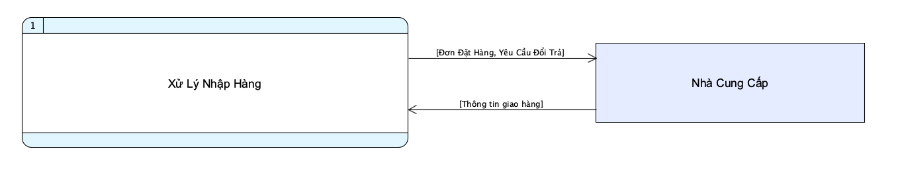

#### Mô hình mức đỉnh (Level 1)

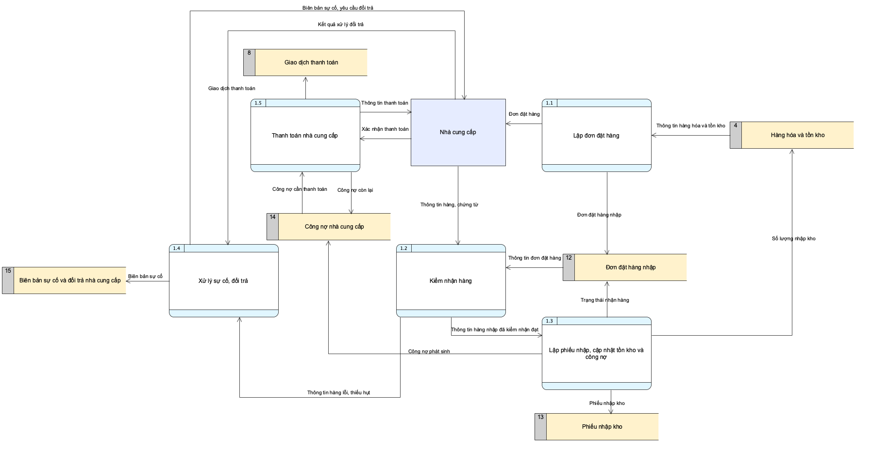

#### Mô hình mức dưới đỉnh (Level 2)

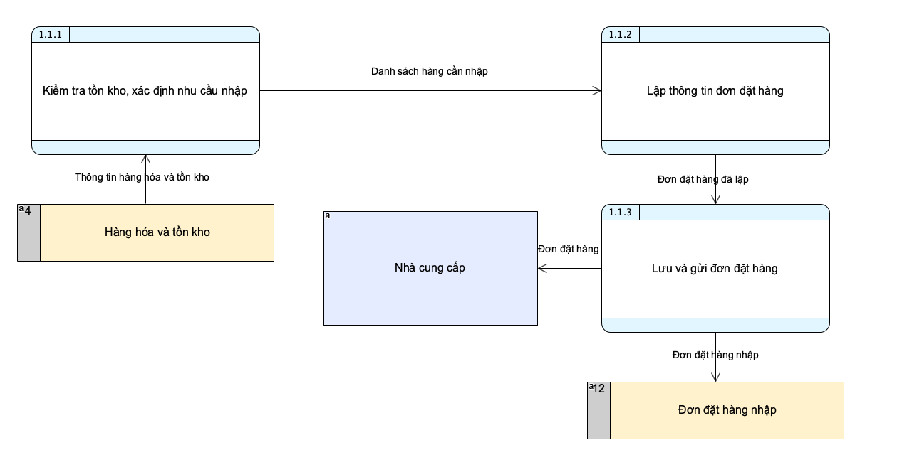

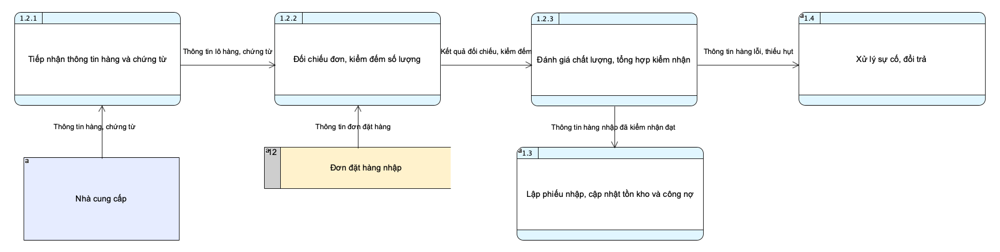

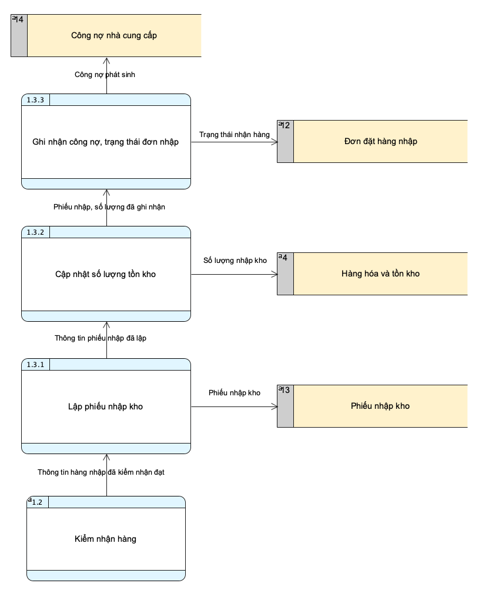

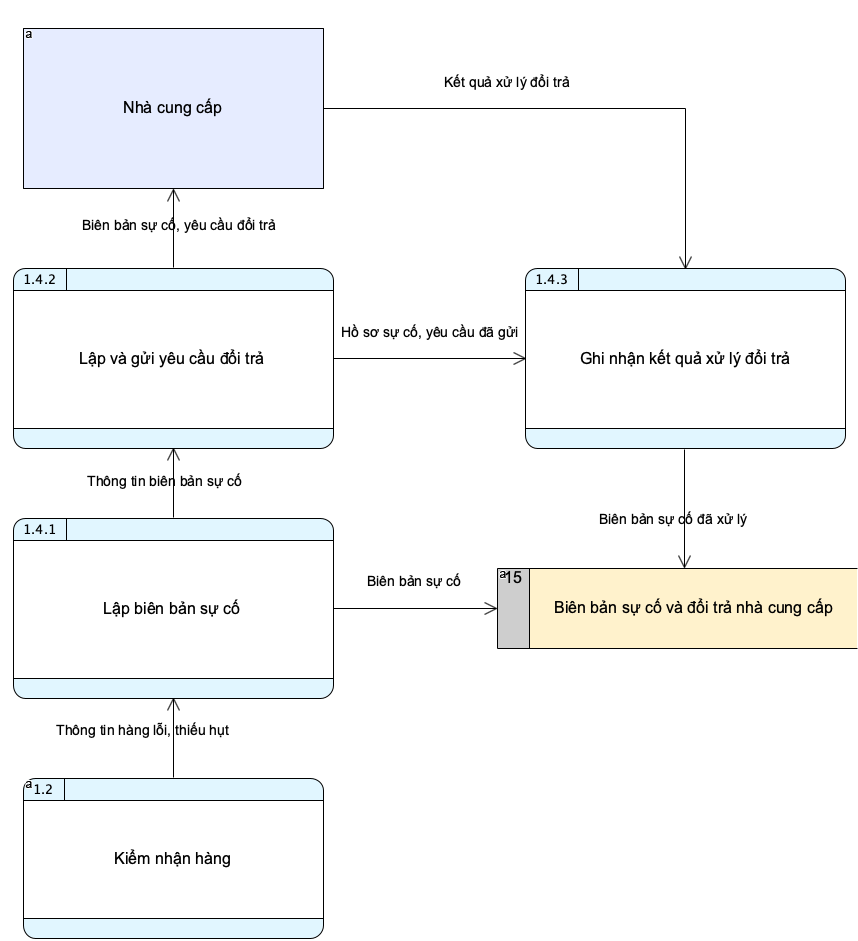

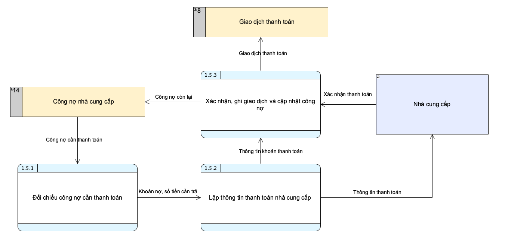

### Chức năng: Bán Hàng

####  Bảng danh sách câu hỏi và trả lời
##### **a. Danh sách câu hỏi và trả lời liên quan đến các ô xử lý (Process)**

1. **Mức 1 được phân rã thành bao nhiêu tiến trình?**
   Có 5 tiến trình: 2.1 Tiếp nhận và kiểm tra đơn hàng; 2.2 Xử lý thanh toán và lập hóa đơn; 2.3 Gửi yêu cầu và theo dõi giao hàng; 2.4 Xử lý đổi trả và hoàn tiền; 2.5 Cấp hàng và đối soát cộng tác viên.
2. **Tiến trình 2.1 được phân rã thành những tiến trình nào?**
   Có 4 tiến trình: 2.1.1 Tiếp nhận thông tin đặt hàng; 2.1.2 Kiểm tra sản phẩm và giá; 2.1.3 Kiểm tra tồn kho; 2.1.4 Kiểm tra khuyến mãi và tính tổng đơn.
3. **2.2 được phân rã thành những tiến trình nào?**
   2.2.1 Tiếp nhận đơn hàng và phương thức thanh toán; 2.2.2 Ghi nhận giao dịch thanh toán; 2.2.3 Xác nhận thanh toán và lập hóa đơn; 2.2.4 Trả kết quả và chuyển đơn giao.
4. **2.3, 2.4 và 2.5 mỗi tiến trình có bao nhiêu tiến trình con?**
   Mỗi tiến trình có 4 tiến trình con. 2.3 gồm tiếp nhận đơn đã thanh toán, chuẩn bị/gửi yêu cầu giao, cập nhật mã vận đơn/trạng thái và thông báo tình trạng giao hàng. 2.4 gồm tiếp nhận yêu cầu đổi trả, kiểm tra điều kiện, ghi nhận đổi trả/yêu cầu hoàn tiền và xử lý hoàn tiền/thông báo kết quả. 2.5 gồm tiếp nhận yêu cầu cấp hàng, kiểm tra tồn kho/cấp hàng, đối chiếu báo cáo doanh số và ghi nhận chuyển tiền/kết quả đối soát.
5. **Nếu sản phẩm hết hàng hoặc chỉ một phần đơn đủ hàng, tiến trình nào xử lý?**
   2.1.3 kiểm tra tồn kho. Cần quyết định rõ là từ chối cả đơn, cho khách sửa đơn hay tách giao; sơ đồ hiện chưa thể hiện nhánh thiếu hàng.
6. **Nếu thanh toán thất bại, tiến trình nào trả kết quả và có chuyển đơn giao không?**
   2.2.2 ghi nhận trạng thái giao dịch, 2.2.3 chỉ xác nhận khi thanh toán thành công và 2.2.4 trả kết quả. Đơn thất bại/đang chờ không nên chuyển sang 2.3; nhánh thất bại cần được vẽ rõ.
7. **Nếu yêu cầu đổi trả không đủ điều kiện hoặc hoàn tiền lỗi thì xử lý ở đâu?**
   2.4.2 kiểm tra điều kiện; 2.4.4 xử lý hoàn tiền và thông báo. Cần bổ sung đầu ra từ chối có lý do và trạng thái hoàn tiền chờ/thất bại nếu hệ thống hỗ trợ xử lý lại.

##### **b. Danh sách câu hỏi và trả lời liên quan đến các dòng dữ liệu (Data Flow)**

1. **Khách hàng gửi những dữ liệu gì vào hệ thống?**
   Khách tại quầy gửi thông tin mua hàng và yêu cầu đổi trả; khách trực tuyến gửi thông tin đặt hàng, người nhận, phương thức thanh toán và yêu cầu đổi trả.
2. **Hệ thống trả dữ liệu gì cho khách hàng?**
   Thông tin thanh toán/hóa đơn, xác nhận đơn hàng, mã vận đơn khi có giao hàng, hoặc kết quả đổi trả và thông tin hoàn tiền.
3. **Cộng tác viên gửi và nhận dữ liệu gì?**
   CTV gửi yêu cầu cấp hàng, báo cáo doanh số và thông tin chuyển tiền; hệ thống gửi xác nhận cấp hàng, thông tin tồn kho, kết quả đối soát và số tiền phải nộp.
4. **Nếu mã giảm giá sai, hết hạn hoặc không đạt điều kiện thì luồng phản hồi nào cần có?**
   2.1.4 nên trả lý do không áp dụng và tổng tiền tính lại để khách xác nhận. Sơ đồ hiện có luồng điều kiện khuyến mãi nhưng chưa thể hiện nhánh từ chối mã.
5. **Nếu cổng thanh toán không phản hồi thì khách và hệ thống nhận trạng thái gì?**
   Cần có trạng thái đang chờ hoặc chưa xác định; không gửi xác nhận thanh toán thành công hay yêu cầu giao hàng cho đến khi có kết quả cuối. Nhánh này chưa có trên sơ đồ.
6. **Nếu đơn vị vận chuyển chưa trả mã vận đơn hoặc báo giao thất bại thì luồng dữ liệu đi đâu?**
   2.3.3 cập nhật trạng thái/mã vận đơn vào D9; 2.3.4 thông báo khách. Cần thể hiện trạng thái chờ, giao thất bại hoặc hoàn hàng nếu nằm trong phạm vi hệ thống.
7. **Nếu CTV nộp thiếu tiền so với doanh số đối chiếu thì dữ liệu chênh lệch đi đâu?**
   2.5.4 cần ghi nhận số phải nộp, số thực nhận, phần chênh lệch và trạng thái đối soát vào D11; cần có luồng thông báo/đề nghị bổ sung nếu quy trình yêu cầu.
8. **Nếu khách hủy đơn sau khi đã gửi yêu cầu giao hàng thì cần trao đổi dữ liệu gì?**
   Cần luồng yêu cầu hủy tới đơn vị vận chuyển, phản hồi khả năng hủy và cập nhật trạng thái đơn/giao hàng. Sơ đồ hiện chưa mô tả trường hợp này.

##### **c. Danh sách câu hỏi và trả lời liên quan đến các kho dữ liệu (Data Store)**

1. **Các kho dữ liệu nào xuất hiện trong các sơ đồ bán hàng?**
   D4 Hàng hóa và tồn kho; D5 Danh mục sản phẩm và giá bán; D6 Mã giảm giá và khuyến mãi; D7 Đơn hàng và hóa đơn; D8 Giao dịch thanh toán; D9 Hồ sơ giao hàng; D10 Hồ sơ đổi trả và hoàn tiền; D11 Đối soát cộng tác viên.
2. **Các tiến trình chính tra cứu/cập nhật những kho nào?**
   2.1 tra cứu D4–D6; 2.2 ghi/tra cứu D7–D8; 2.3 cập nhật D9; 2.4 tra cứu D7, cập nhật D8 khi hoàn tiền và ghi D10; 2.5 tra cứu/cập nhật D4, đối chiếu D7 và cập nhật D11.
3. **D8 cần lưu gì để phân biệt giao dịch thành công, thất bại, đang chờ và hoàn tiền?**
   Nên có mã giao dịch, mã đơn, số tiền, phương thức, thời điểm và trạng thái. Sơ đồ hiện chưa nêu rõ các trạng thái chi tiết.
4. **D9 và D10 cần lưu gì để xử lý lỗi giao hàng hoặc hoàn tiền?**
   D9 nên lưu mã vận đơn, trạng thái gần nhất, thời điểm cập nhật và lý do giao thất bại. D10 nên lưu điều kiện/kết quả đổi trả, số tiền và trạng thái hoàn tiền cùng lịch sử xử lý.
5. **D11 cần lưu gì khi số tiền CTV nộp không khớp?**
   Nên lưu doanh số báo cáo, số phải nộp, số thực nhận, chênh lệch, trạng thái và ghi chú xử lý để tiếp tục đối soát.
6. **Khi hủy đơn hoặc nhận hàng đổi trả, lúc nào D4 được cập nhật?**
   Cần quy định thời điểm nhả hàng đã giữ chỗ hoặc nhập lại hàng sau khi kiểm tra đủ điều kiện; không nên tăng tồn chỉ dựa trên yêu cầu đổi trả. Luồng cập nhật tồn trong các trường hợp này chưa được mô tả rõ.

##### **d. Danh sách câu hỏi và trả lời liên quan đến các thực thể ngoài (External Entity)**

1. **Các thực thể ngoài của hệ thống bán hàng là ai?**
   Khách hàng tại quầy, khách hàng trực tuyến, cộng tác viên và đơn vị vận chuyển.
2. **Vai trò và dữ liệu trao đổi của từng thực thể là gì?**
   Hai nhóm khách hàng đặt mua/yêu cầu đổi trả; CTV yêu cầu cấp hàng, gửi báo cáo doanh số và chuyển tiền; đơn vị vận chuyển nhận thông tin giao hàng và trả mã vận đơn/trạng thái.
3. **Khách hàng cần nhận gì khi đơn bị từ chối, thanh toán lỗi hoặc đổi trả không đạt điều kiện?**
   Cần nhận trạng thái kèm lý do và bước tiếp theo (sửa đơn, thử thanh toán lại hoặc bổ sung thông tin). Những phản hồi lỗi này cần được thêm vào sơ đồ.
4. **Nếu CTV không gửi báo cáo hoặc chứng từ chuyển tiền đúng kỳ thì thực thể nào khởi tạo nhắc nhở?**
   Cần xác định hệ thống hay nhân viên phụ trách đối soát sẽ nhắc CTV; quy trình quá hạn hiện chưa có trong sơ đồ.
5. **Nếu đơn vị vận chuyển báo giao thất bại, giao nhầm hoặc hoàn hàng thì ai cần được thông báo?**
   Hệ thống cần cập nhật D9 và thông báo khách trực tuyến cùng nhân viên xử lý đơn; cần xác nhận phạm vi và bổ sung các luồng thông báo tương ứng.

#### Mô hình mức ngữ cảnh (Context Level)

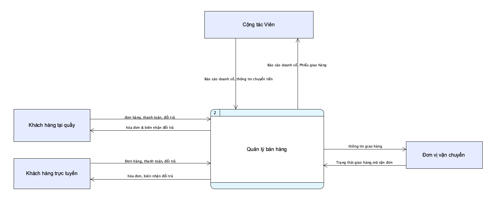

#### Mô hình mức đỉnh (Level 1)

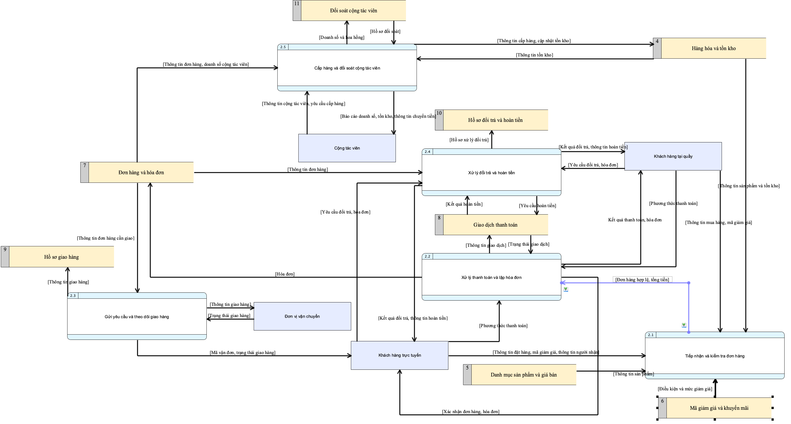

#### Mô hình mức dưới đỉnh (Level 2)

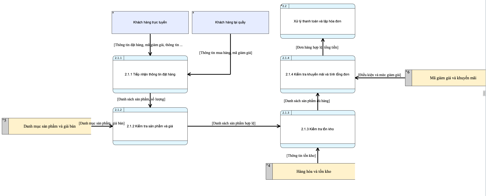

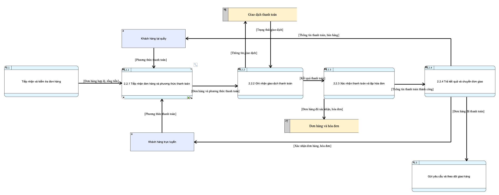

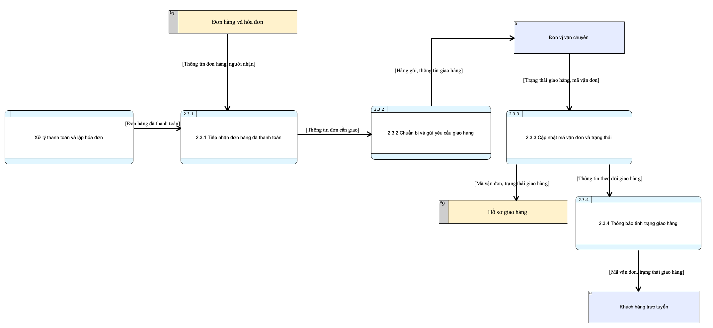

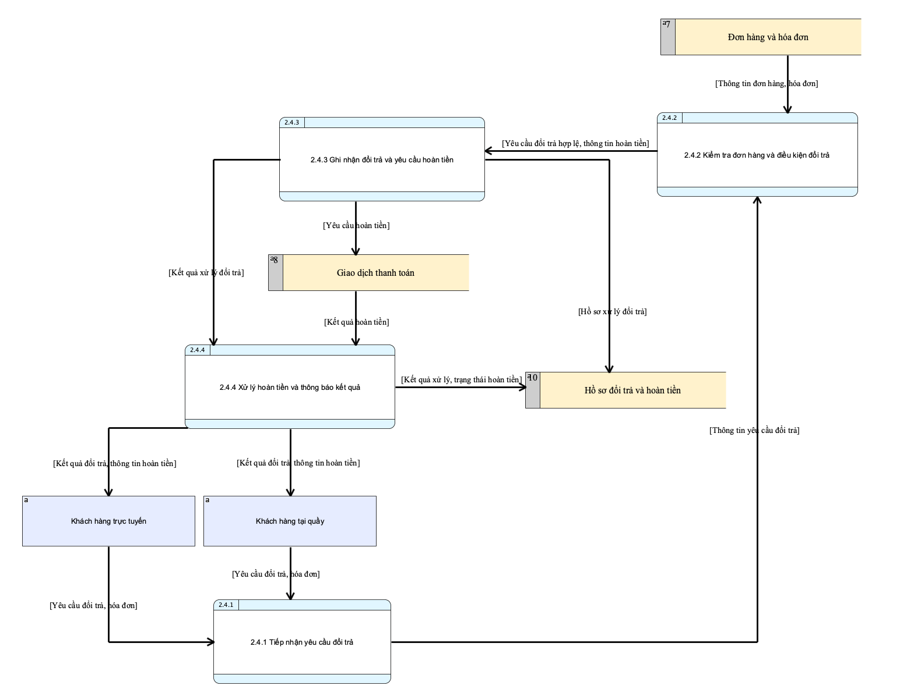

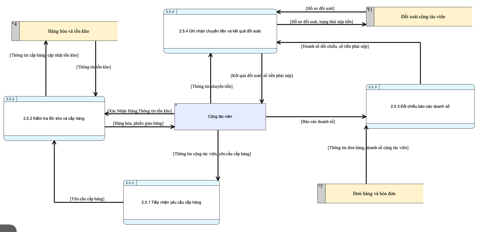

### Chức năng: Tổ Chức Giải Đấu & Tài Trợ Sự Kiện

####  Bảng danh sách câu hỏi và trả lời
Câu hỏi 1: Xác định các tác nhân ngoài tương tác trực tiếp với chức năng "Tổ Chức Giải Đấu & Tài Trợ Sự Kiện"?
Trả lời:Các tác nhân ngoài bao gồm: Người tham gia (đăng ký, nộp lệ phí, thi đấu), Nhà tài trợ (cung cấp kinh phí, hiện vật tài trợ), và Trọng tài sự kiện (cập nhật tỷ số, kết quả thi đấu). Quản lý giải đấu là người vận hành bên trong hệ thống.

Câu hỏi 2: Kho lưu trữ dữ liệu chính nào được sử dụng trong quá trình xử lý giải đấu và tài trợ?
Trả lời: Các kho dữ liệu chính gồm: Kho thông tin sự kiện/giải đấu, Kho dữ liệu người tham gia & đăng ký, Kho tài trợ, và liên kết với Kho hàng/Tồn kho (khi xuất vật phẩm trao thưởng).

Câu hỏi 3: Luồng dữ liệu chính đi từ người tham gia vào hệ thống trong quy trình này là gì?
Trả lời: Thông tin đăng ký tham gia giải đấu, thông tin xác nhận nộp lệ phí (hoặc thanh toán lệ phí).

Câu hỏi 4: Nhiệm vụ của tiến trình xử lý kết quả và trao thưởng trong mô hình mức đỉnh là gì?
Trả lời: Hệ thống tự động tổng kết bảng xếp hạng chung cuộc dựa trên tỷ số do trọng tài cập nhật, đồng thời tạo phiếu xuất kho các phần quà tài trợ và vật phẩm của cửa hàng để trao thưởng cho đấu thủ chiến thắng.

#### Mô hình mức ngữ cảnh (Context Level)

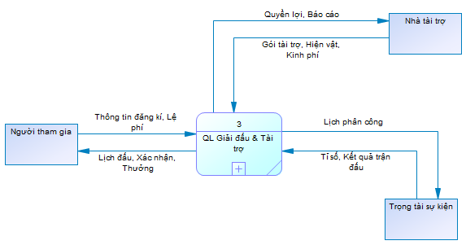

#### Mô hình mức đỉnh (Level 1)

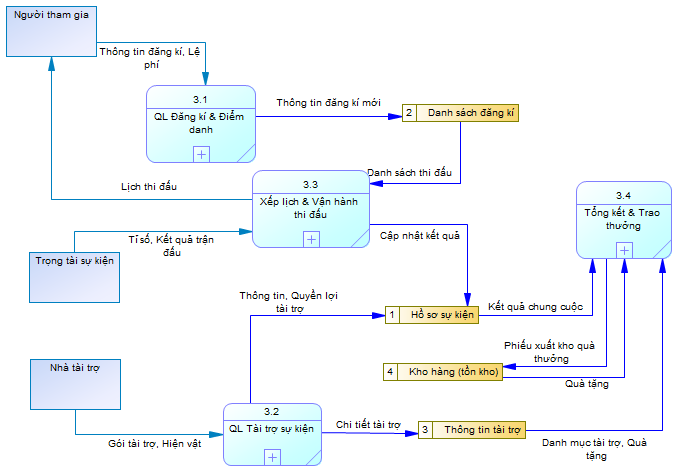

#### Mô hình mức dưới đỉnh (Level 2)

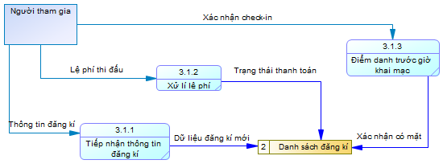

---

### Chức năng: Quản lý Kho

> [!NOTE]
> **CHƯA HOÀN THIỆN**
>
> Chưa bổ sung mô hình DFD.

#### Bảng danh sách câu hỏi và trả lời

> [!NOTE]
> **CHỜ BỔ SUNG**
>
> Bổ sung câu hỏi và trả lời về tiến trình, luồng dữ liệu, kho dữ liệu và thực thể ngoài.

#### Mô hình mức ngữ cảnh (Context Level)

> [!NOTE]
> **CHỜ BỔ SUNG**
>
> Bổ sung sơ đồ DFD mức ngữ cảnh.

#### Mô hình mức đỉnh (Level 1)

> [!NOTE]
> **CHỜ BỔ SUNG**
>
> Bổ sung sơ đồ DFD mức đỉnh.

#### Mô hình mức dưới đỉnh (Level 2)

> [!NOTE]
> **CHỜ BỔ SUNG**
>
> Bổ sung sơ đồ phân rã các tiến trình mức đỉnh.

---

### Chức năng: Quản lý Nhân Viên và Cộng Tác Viên

> [!NOTE]
> **CHƯA HOÀN THIỆN**
>
> Chưa bổ sung mô hình DFD.

#### Bảng danh sách câu hỏi và trả lời

a. Các ô xử lý (Process)

1. Mức ngữ cảnh có bao nhiêu tiến trình, được phân rã thành bao nhiêu tiến trình ở Level 1?

Mức ngữ cảnh có 1 tiến trình: 4 -- Hệ thống Quản lý Nhân viên và Cộng tác viên. Level 1 phân rã thành 4 tiến trình:

4.1 Quản lý hồ sơ nhân viên & CTV
4.2 Phân ca & Chấm công
4.3 Tính lương & Hoa hồng
4.4 Đánh giá & Báo cáo nhân sự

2. Tiến trình nào quản lý hồ sơ nhân viên và CTV?

4.1 -- Quản lý hồ sơ nhân viên & CTV nhận "Thông tin cá nhân" từ Nhân viên và từ Cộng tác viên, rồi ghi "Thông tin nhân viên & CTV" vào kho D1. Hồ sơ không cần phê duyệt; Cộng tác viên được xem là đã xác thực nên không có bước đăng kí.

3. Tiến trình nào phân ca và chấm công?

4.2 -- Phân ca & Chấm công nhận "Danh sách nhân viên" từ kho D1; "Đăng kí ca, Yêu cầu nghỉ" và "Dữ liệu chấm công" từ Nhân viên; "Duyệt ca, Duyệt nghỉ" từ Quản lí cửa hàng. Tiến trình gửi "Lịch làm việc, Thông báo duyệt nghỉ" cho Nhân viên, gửi "Ca, Nghỉ cần duyệt" cho Quản lí cửa hàng và ghi "Lịch làm việc, Dữ liệu chấm công" vào kho D2.

4. Tiến trình nào tính lương và hoa hồng?

4.3 -- Tính lương & Hoa hồng nhận "Giờ công" từ kho D2, "Mức lương, Tỉ lệ hoa hồng" từ kho D1, "Mức hoa hồng" từ Quản lí cửa hàng và "Báo cáo doanh số" từ Cộng tác viên. Tiến trình gửi "Phiếu lương" cho Nhân viên, gửi "Mức hoa hồng" cho Cộng tác viên và ghi "Bảng lương, Hoa hồng" vào kho D3. Cộng tác viên không nhận hoa hồng trực tiếp từ chủ shop mà dựa vào "Mức hoa hồng" để tự trừ khi chuyển tiền lại cho chủ shop.

5. Tiến trình nào đánh giá và lập báo cáo nhân sự?

4.4 -- Đánh giá & Báo cáo nhân sự nhận "Dữ liệu lương, Hoa hồng" từ kho D3 và "Dữ liệu chấm công" từ kho D2; gửi "Báo cáo nhân sự" cho Quản lí cửa hàng và "Kết quả đánh giá" cho Nhân viên.

6. Nếu Nhân viên xin nghỉ thì tiến trình nào xử lý?

Tiến trình 4.2 -- Phân ca & Chấm công xử lý, cụ thể là tiến trình con 4.2.2 tiếp nhận yêu cầu nghỉ. Yêu cầu được chuyển sang 4.2.3 để gửi "Ca, Nghỉ cần duyệt" cho Quản lí cửa hàng, nhận "Duyệt ca, Duyệt nghỉ", sau đó gửi "Lịch làm việc, Thông báo duyệt nghỉ" cho Nhân viên và cập nhật lịch làm việc vào kho D2.

7. 4.1 được phân rã thành những tiến trình nào?

4.1.1 Tiếp nhận & Kiểm tra thông tin
4.1.2 Lưu thông tin nhân viên & CTV

8. 4.2 được phân rã thành những tiến trình nào?

4.2.1 Tiếp nhận đăng kí ca
4.2.2 Tiếp nhận yêu cầu nghỉ
4.2.3 Xếp lịch & Duyệt ca, nghỉ
4.2.4 Ghi nhận chấm công

9. 4.3 được phân rã thành những tiến trình nào?

4.3.1 Tổng hợp giờ công & doanh số
4.3.2 Tính lương & hoa hồng
4.3.3 Lập phiếu lương & Ghi nhận hoa hồng

10. 4.4 được phân rã thành những tiến trình nào?

4.4.1 Tổng hợp dữ liệu nhân sự
4.4.2 Đánh giá hiệu suất
4.4.3 Lập báo cáo nhân sự

11. Các tiến trình con của 4.1 nhận và trả dữ liệu gì?

4.1.1 nhận "Thông tin cá nhân" từ Nhân viên và từ Cộng tác viên; gửi "Thông tin đã kiểm tra" cho 4.1.2.
4.1.2 nhận "Thông tin đã kiểm tra" từ 4.1.1; ghi "Thông tin nhân viên & CTV" vào kho D1.

12. Các tiến trình con của 4.2 nhận và trả dữ liệu gì?

4.2.1 nhận "Đăng kí ca" từ Nhân viên; gửi "Yêu cầu ca" cho 4.2.3.
4.2.2 nhận "Yêu cầu nghỉ" từ Nhân viên; gửi "Yêu cầu nghỉ" cho 4.2.3.
4.2.3 nhận "Yêu cầu ca" từ 4.2.1, "Yêu cầu nghỉ" từ 4.2.2 và "Danh sách nhân viên" từ kho D1; gửi "Ca, Nghỉ cần duyệt" cho Quản lí cửa hàng; nhận "Duyệt ca, Duyệt nghỉ" từ Quản lí cửa hàng; gửi "Lịch làm việc, Thông báo duyệt nghỉ" cho Nhân viên và ghi "Lịch làm việc" vào kho D2.
4.2.4 nhận "Dữ liệu chấm công" từ Nhân viên và ghi "Dữ liệu chấm công" vào kho D2.

13. Các tiến trình con của 4.3 nhận và trả dữ liệu gì?

4.3.1 nhận "Giờ công" từ kho D2 và "Báo cáo doanh số" từ Cộng tác viên; gửi "Giờ công & doanh số" cho 4.3.2.
4.3.2 nhận "Giờ công & doanh số" từ 4.3.1, "Mức lương, Tỉ lệ hoa hồng" từ kho D1 và "Mức hoa hồng" từ Quản lí cửa hàng; gửi "Kết quả tính lương, hoa hồng" cho 4.3.3.
4.3.3 nhận kết quả tính; gửi "Phiếu lương" cho Nhân viên, gửi "Mức hoa hồng" cho Cộng tác viên và ghi "Bảng lương, Hoa hồng" vào kho D3.

14. Các tiến trình con của 4.4 nhận và trả dữ liệu gì?

4.4.1 nhận "Dữ liệu lương, Hoa hồng" từ kho D3 và "Dữ liệu chấm công" từ kho D2; gửi "Dữ liệu nhân sự tổng hợp" cho 4.4.2.
4.4.2 nhận dữ liệu tổng hợp; gửi "Kết quả đánh giá" cho Nhân viên và "Kết quả đánh giá hiệu suất" cho 4.4.3.
4.4.3 nhận kết quả đánh giá hiệu suất; gửi "Báo cáo nhân sự" cho Quản lí cửa hàng.
b. Các dòng dữ liệu (Data Flow)

1. Nhân viên gửi những dữ liệu gì vào hệ thống?

Ở mức ngữ cảnh, Nhân viên gửi "Thông tin cá nhân, Đăng kí ca, Yêu cầu nghỉ, Dữ liệu chấm công". Ở Level 1, các dữ liệu này được chuyển đến 4.1 và 4.2 theo chức năng tương ứng.

2. Hệ thống trả dữ liệu gì cho Nhân viên?

Ở mức ngữ cảnh, hệ thống trả "Lịch làm việc, Thông báo duyệt nghỉ, Phiếu lương, Kết quả đánh giá". Ở Level 1, các dữ liệu này lần lượt do 4.2, 4.3 và 4.4 cung cấp.

3. Cộng tác viên gửi và nhận dữ liệu gì?

Cộng tác viên gửi "Thông tin cá nhân" đến 4.1 và "Báo cáo doanh số" đến 4.3; nhận "Mức hoa hồng" từ 4.3 để tự trừ hoa hồng khi chuyển tiền lại cho chủ shop.

4. Quản lí cửa hàng gửi và nhận dữ liệu gì?

Quản lí cửa hàng gửi "Duyệt ca, Duyệt nghỉ" đến 4.2 và "Mức hoa hồng" đến 4.3; nhận "Ca, Nghỉ cần duyệt" từ 4.2 và "Báo cáo nhân sự" từ 4.4.

5. Giữa mức ngữ cảnh và Level 1 các luồng được tổng hợp như thế nào?

Các luồng của cùng một thực thể ngoài ở Level 1 được tổng hợp thành luồng vào/ra tương ứng ở mức ngữ cảnh. Ví dụ, các dữ liệu Nhân viên gửi đến 4.1 và 4.2 được gộp thành "Thông tin cá nhân, Đăng kí ca, Yêu cầu nghỉ, Dữ liệu chấm công".

6. Giữa các tiến trình con có những luồng dữ liệu nào?

Các luồng nội bộ gồm:

4.1.1 → 4.1.2: "Thông tin đã kiểm tra".
4.2.1 → 4.2.3: "Yêu cầu ca".
4.2.2 → 4.2.3: "Yêu cầu nghỉ".
4.3.1 → 4.3.2: "Giờ công & doanh số".
4.3.2 → 4.3.3: "Kết quả tính lương, hoa hồng".
4.4.1 → 4.4.2: "Dữ liệu nhân sự tổng hợp".
4.4.2 → 4.4.3: "Kết quả đánh giá hiệu suất".

7. Luồng "Lịch làm việc, Dữ liệu chấm công" ở Level 1 được tách như thế nào ở Level 2?

Ở Level 2, luồng tổng hợp được tách thành:

4.2.3 ghi "Lịch làm việc" vào kho D2.
4.2.4 ghi "Dữ liệu chấm công" vào kho D2.
c. Các kho dữ liệu (Data Store)

1. Các kho dữ liệu nào xuất hiện trong sơ đồ?

D1: Hồ sơ nhân viên & CTV.
D2: Lịch làm việc & chấm công.
D3: Bảng lương & hoa hồng.

2. Các tiến trình chính tra cứu/cập nhật những kho nào?

4.1 ghi kho D1.
4.2 đọc kho D1 và ghi kho D2.
4.3 đọc kho D1, kho D2 và ghi kho D3.
4.4 đọc kho D2 và kho D3.

3. Kho D1 nhận và trả dữ liệu gì?

Kho D1 nhận "Thông tin nhân viên & CTV" từ 4.1; trả "Danh sách nhân viên" cho 4.2 và "Mức lương, Tỉ lệ hoa hồng" cho 4.3.

4. Kho D2 nhận và trả dữ liệu gì?

Kho D2 nhận "Lịch làm việc" và "Dữ liệu chấm công" từ 4.2; trả "Giờ công" cho 4.3 và "Dữ liệu chấm công" cho 4.4.

5. Kho D3 nhận và trả dữ liệu gì?

Kho D3 nhận "Bảng lương, Hoa hồng" từ 4.3; trả "Dữ liệu lương, Hoa hồng" cho 4.4.

6. Các kho dữ liệu được đọc và ghi bởi tiến trình con nào?

Kho D1: ghi bởi 4.1.2; đọc bởi 4.2.3 và 4.3.2.
Kho D2: ghi bởi 4.2.3 và 4.2.4; đọc bởi 4.3.1 và 4.4.1.
Kho D3: ghi bởi 4.3.3; đọc bởi 4.4.1.
d. Cơ sở dữ liệu (Database)

1. Cơ sở dữ liệu (database) là gì và dùng để làm gì trong hệ thống?

Cơ sở dữ liệu là nơi lưu trữ có tổ chức các dữ liệu của hệ thống để tiến trình đọc hoặc ghi khi cần. Hệ thống dùng một cơ sở dữ liệu quan hệ duy nhất (CSDL Quản lý nhân sự) để lưu toàn bộ dữ liệu của nhân viên, cộng tác viên, lịch làm việc, chấm công, lương và hoa hồng.

2. Các kho dữ liệu D1, D2, D3 được cài đặt thành cơ sở dữ liệu như thế nào?

Ba kho D1, D2, D3 trong DFD cùng nằm trong CSDL Quản lý nhân sự. Mỗi kho tương ứng với một nhóm bảng:

Kho D1 gồm bảng NHAN_VIEN và CONG_TAC_VIEN.
Kho D2 gồm bảng LICH_LAM_VIEC và CHAM_CONG.
Kho D3 gồm bảng BANG_LUONG và HOA_HONG.

3. Cơ sở dữ liệu gồm bao nhiêu bảng?

Cơ sở dữ liệu gồm 6 bảng: NHAN_VIEN, CONG_TAC_VIEN, LICH_LAM_VIEC, CHAM_CONG, BANG_LUONG và HOA_HONG.

4. Khóa chính và khóa ngoại của các bảng là gì?

NHAN_VIEN: khóa chính MaNV.
CONG_TAC_VIEN: khóa chính MaCTV.
LICH_LAM_VIEC: khóa chính MaLich; khóa ngoại MaNV tham chiếu NHAN_VIEN.
CHAM_CONG: khóa chính MaCC; khóa ngoại MaNV tham chiếu NHAN_VIEN.
BANG_LUONG: khóa chính MaBL; khóa ngoại MaNV tham chiếu NHAN_VIEN.
HOA_HONG: khóa chính MaHH; khóa ngoại MaCTV tham chiếu CONG_TAC_VIEN.

5. Các bảng quan hệ với nhau như thế nào?

Một nhân viên có nhiều dòng lịch làm việc, chấm công và bảng lương. Một cộng tác viên có nhiều dòng hoa hồng. Thuộc tính và kiểu dữ liệu chi tiết của từng bảng xem mục IV.

e. Các thực thể ngoài (External Entity)

1. Các thực thể ngoài của hệ thống là ai?

Nhân viên.
Cộng tác viên (được xem là đã xác thực).
Quản lí cửa hàng.

2. Vai trò và dữ liệu trao đổi của từng thực thể là gì?

Nhân viên: gửi thông tin cá nhân, đăng kí ca, yêu cầu nghỉ và dữ liệu chấm công; nhận lịch làm việc, thông báo duyệt nghỉ, phiếu lương và kết quả đánh giá.
Cộng tác viên: gửi thông tin cá nhân và báo cáo doanh số; nhận mức hoa hồng.
Quản lí cửa hàng: gửi duyệt ca/nghỉ và chính sách lương & hoa hồng; nhận ca/nghỉ cần duyệt và báo cáo nhân sự.

3. Mỗi thực thể ngoài xuất hiện ở những sơ đồ nào?

Cả ba thực thể ngoài đều xuất hiện ở mức ngữ cảnh, Level 1 và các sơ đồ Level 2 có liên quan đến chức năng của họ.

4. Thực thể nào nhận dữ liệu từ nhiều tiến trình nhất?

Nhân viên nhận dữ liệu từ ba tiến trình chính: 4.2 (Lịch làm việc, Thông báo duyệt nghỉ), 4.3 (Phiếu lương) và 4.4 (Kết quả đánh giá).

#### Mô hình mức ngữ cảnh (Context Level)

#### Mô hình mức đỉnh (Level 1)

#### Mô hình mức dưới đỉnh (Level 2)

### Chức năng: Quản lý nội dung Fanpage

> [!NOTE]
> **CHƯA HOÀN THIỆN**
>
> Chưa bổ sung mô hình DFD.

#### Bảng danh sách câu hỏi và trả lời

> [!NOTE]
> **CHỜ BỔ SUNG**
>
> Bổ sung câu hỏi và trả lời về tiến trình, luồng dữ liệu, kho dữ liệu và thực thể ngoài.

#### Mô hình mức ngữ cảnh (Context Level)

> [!NOTE]
> **CHỜ BỔ SUNG**
>
> Bổ sung sơ đồ DFD mức ngữ cảnh.

#### Mô hình mức đỉnh (Level 1)

> [!NOTE]
> **CHỜ BỔ SUNG**
>
> Bổ sung sơ đồ DFD mức đỉnh.

#### Mô hình mức dưới đỉnh (Level 2)

> [!NOTE]
> **CHỜ BỔ SUNG**
>
> Bổ sung sơ đồ phân rã các tiến trình mức đỉnh.

---

### Chức năng: Quản lý order nước ngoài

> [!NOTE]
> **CHƯA HOÀN THIỆN**
>
> Chưa bổ sung mô hình DFD.

#### Bảng danh sách câu hỏi và trả lời

> [!NOTE]
> **CHỜ BỔ SUNG**
>
> Bổ sung câu hỏi và trả lời về tiến trình, luồng dữ liệu, kho dữ liệu và thực thể ngoài; xác định cách biểu diễn các sàn Mercari, Taobao trong thực thể chung Sàn thương mại điện tử nước ngoài.

#### Mô hình mức ngữ cảnh (Context Level)

> [!NOTE]
> **CHỜ BỔ SUNG**
>
> Bổ sung sơ đồ DFD mức ngữ cảnh.

#### Mô hình mức đỉnh (Level 1)

> [!NOTE]
> **CHỜ BỔ SUNG**
>
> Bổ sung sơ đồ DFD mức đỉnh.

#### Mô hình mức dưới đỉnh (Level 2)

> [!NOTE]
> **CHỜ BỔ SUNG**
>
> Bổ sung sơ đồ phân rã các tiến trình mức đỉnh.
---
