# ĐẶC TẢ HỆ THỐNG

## Giới thiệu dự án

TTshop là dự án phân tích và đặc tả hệ thống quản lý cửa hàng phụ kiện trò chơi thẻ bài, hỗ trợ hoạt động bán hàng tại quầy, bán hàng trực tuyến và phân phối qua cộng tác viên. Hệ thống bao gồm các nghiệp vụ nhập hàng, quản lý kho, bán hàng, quản lý nhân viên và cộng tác viên, cùng tổ chức giải đấu và quản lý tài trợ sự kiện.

Dự án hướng đến việc quản lý tập trung thông tin hàng hóa, đơn hàng, thanh toán và sự kiện, giúp cửa hàng theo dõi tồn kho, kiểm soát công nợ và phối hợp các hoạt động kinh doanh. Tài liệu này trình bày các quy trình nghiệp vụ, kho dữ liệu và sơ đồ luồng dữ liệu (DFD), làm cơ sở cho việc thiết kế và phát triển hệ thống.

## 1. Liệt kê các chức năng và đặc tả quy trình hoạt động, xử lý của hệ thống

### 1.1. Danh sách các chức năng
1. Chức năng Nhập hàng
2. Chức năng Quản lý Kho
3. Chức năng Bán Hàng
4. Chức năng Quản lý Nhân Viên và Cộng Tác Viên
5. Chức năng Quản lý Giải Đấu và Tài Trợ Sự Kiện
6. Chức năng quản lý nội dung Fanpage

### 1.2. Đặc tả quy trình hoạt động và xử lý

#### Chức năng: Nhập hàng
- **Mục đích:** Quản lý quy trình mua hàng từ nhà cung cấp, kiểm đếm số lượng, chất lượng và cập nhật dữ liệu nhập kho vào hệ thống.
- **Đối tượng thực hiện:** Quản lý cửa hàng, Nhân viên mua/nhập hàng.
- **Quy trình hoạt động & xử lý:**  
  Quy trình nhập hàng bắt đầu khi nhân viên kiểm tra lượng tồn kho và nhận thấy các mặt hàng phụ kiện  chạm mức tối thiểu, từ đó tiến hành lập đơn đặt hàng  gửi đến nhà cung cấp. Khi nhận được hàng bàn giao, nhân viên kho cùng quản lý tiến hành đối chiếu với hóa đơn chứng từ, kiểm tra thực tế số lượng, chất lượng bao bì và tính toàn vẹn của từng sản phẩm. Nếu lô hàng đạt chuẩn, nhân viên tạo phiếu nhập kho trên hệ thống để ghi nhận công nợ và tự động cập nhật tăng số lượng tồn kho theo thời gian thực. Trường hợp phát hiện hàng hóa không đạt chuẩn hoặc thiếu hụt số lượng, nhân viên sẽ lập biên bản sự cố ngay tại chỗ để từ chối nhận hoặc yêu cầu nhà cung cấp thực hiện đổi trả.

#### Chức năng: Quản lý Kho
- **Mục đích:** Theo dõi chính xác lượng hàng tồn kho tại cửa hàng và các điểm phân phối, quản lý vị trí lưu trữ, điều phối xuất chuyển hàng cho cộng tác viên ở các khu vực và kiểm soát thất thoát hàng hóa.
- **Đối tượng thực hiện:** Nhân viên kho, Quản lý cửa hàng.
- **Quy trình hoạt động & xử lý:**  
  Quy trình quản lý kho vận hành liên tục nhằm kiểm soát biến động hàng hóa tại kho chính và các điểm lưu trữ của cộng tác viên ở xa. Mỗi khi phát sinh giao dịch nhập hàng, bán lẻ, xuất chuyển cho cộng tác viên hoặc xuất thưởng giải đấu, hệ thống sẽ tự động cập nhật số lượng tồn kho theo thời gian thực. Khi cộng tác viên tại các khu vực khác có nhu cầu lấy hàng về bán, nhân viên kho lập phiếu xuất kho chuyển hàng gắn theo mã số của cộng tác viên đó, hệ thống sẽ tự động trừ lượng tồn tại kho chính và ghi nhận số lượng chuyển vào kho ký gửi của cộng tác viên. Định kỳ, nhân viên thực hiện quét mã kiểm kê thực tế tại quầy và đối chiếu số lượng hàng ký gửi từ xa để phát hiện sai lệch, hàng hư hỏng nhằm xử lý thất thoát. Trường hợp cộng tác viên không bán hết hoặc đổi trả, kho sẽ lập phiếu nhập hoàn để thu hồi hàng về kho chính.

#### Chức năng: Bán Hàng
- **Mục đích:** Quản lý và xử lý toàn diện quy trình bán hàng đa kênh bao gồm bán trực tiếp tại quầy và bán hàng trực tuyến (qua trang mạng, kênh bán hàng); tính tiền, áp dụng ưu đãi, xác nhận thanh toán, đóng gói giao vận và in hóa đơn cho khách hàng.
- **Đối tượng thực hiện:** Thu ngân, Nhân viên xử lý đơn trực tuyến, Khách hàng (tại quầy và mua từ xa), Đơn vị vận chuyển.
- **Quy trình hoạt động & xử lý:**  
  Quy trình bán hàng tiếp nhận và xử lý đơn hàng linh hoạt qua cả hai kênh trực tiếp tại quầy và bán hàng trực tuyến. Đối với khách mua tại quầy, nhân viên thu ngân quét mã vạch sản phẩm; đối với đơn hàng mua từ xa, nhân viên tiếp nhận thông tin từ hệ thống để xác nhận đơn và tạo phiếu đặt hàng. Hệ thống tự động kiểm tra lượng hàng tồn sẵn sàng bán, áp dụng phiếu giảm giá, tích điểm thành viên và tính toán phí vận chuyển. Khách hàng lựa chọn các phương thức thanh toán linh hoạt như tiền mặt, chuyển khoản qua mã phản hồi nhanh, thẻ ngân hàng hoặc thanh toán khi nhận hàng. Ngay khi thanh toán thành công hoặc đơn hàng từ xa được duyệt, hệ thống tự động trừ kho tức thời, in hóa đơn và phiếu gửi hàng để giao cho đơn vị vận chuyển hoặc đưa trực tiếp cho khách, đồng thời ghi nhận doanh thu vào hệ thống. Quy trình cũng hỗ trợ tiếp nhận đổi trả cho cả hai kênh nếu sản phẩm còn nguyên bao bì và có hóa đơn hợp lệ.

#### Chức năng: Quản Lý Nhân Viên và Cộng Tác Viên
- **Mục đích:** Quản lý hồ sơ, phân quyền tài khoản, theo dõi ca làm việc và đánh giá hiệu suất bán hàng của nhân viên chính thức; đồng thời quản lý thông tin, cấp mã số định danh, theo dõi danh mục hàng hóa cấp phát, kiểm soát công nợ sản phẩm và thanh toán hoa hồng cho cộng tác viên tại các khu vực xa (cộng tác viên không có tài khoản đăng nhập hệ thống).
- **Đối tượng thực hiện:** Quản lý cửa hàng, Nhân viên bán hàng (Cộng tác viên được quản lý qua mã số định danh, không có tài khoản đăng nhập).
- **Quy trình hoạt động & xử lý:**  
  Quy trình quản lý nhân sự tập trung vào việc điều phối nhân lực và quản lý hoạt động phân phối hàng hóa của cộng tác viên. Quản lý thực hiện cấp tài khoản cho nhân viên làm việc tại quầy để xếp ca, chấm công và theo dõi doanh thu ca trực. Riêng đội ngũ cộng tác viên tại các khu vực xa không được cấp tài khoản truy cập hệ thống mà chỉ được cấp một mã số cộng tác viên định danh. Khi cộng tác viên nhập hàng từ kho về bán, hệ thống sẽ ghi nhận danh mục và số lượng sản phẩm cấp phát theo mã số tương ứng để theo dõi công nợ hàng hóa. Đến kỳ đối soát, quản lý cập nhật số lượng hàng cộng tác viên đã bán thực tế và số tiền nộp về để hệ thống tự động tính toán theo tỷ lệ hoa hồng chiết khấu, đồng thời kiểm soát lượng hàng còn tồn đọng hoặc hư hỏng tại từng khu vực.

#### Chức năng: Quản Lý Giải Đấu và Tài Trợ Sự Kiện
- **Mục đích:** 
  - Tổ chức, vận hành và điều phối các sự kiện, giải đấu giao lưu, thi đấu tại cửa hàng từ khâu đăng ký, bốc thăm chia cặp đến tổng kết trao thưởng.
  - Quản lý và khai thác các nguồn lực tài trợ (hiện vật độc quyền, kinh phí tổ chức) từ các đối tác phân phối và nhà sản xuất phụ kiện nhằm giảm chi phí vận hành cho cửa hàng.
  - Tối ưu hóa lợi nhuận, thúc đẩy doanh số bán lẻ phụ kiện thi đấu (bọc bài, hộp đựng bài, thảm đấu) và gia tăng giá trị gắn bó dài lâu của khách hàng.
- **Đối tượng thực hiện:** Quản lý giải đấu, Nhà tài trợ, Trọng tài sự kiện, Người tham gia.
- **Quy trình hoạt động & xử lý:**  
  Quy trình quản lý giải đấu và tài trợ bắt đầu khi ban tổ chức khởi tạo thông tin sự kiện trên hệ thống, xác định thể thức thi đấu, lệ phí tham gia và cơ cấu giải thưởng. Đồng thời, hệ thống tiếp nhận thông tin từ các nhà tài trợ (nếu có), ghi nhận gói tài trợ bằng hiện vật độc quyền (thảm đấu vô địch, bọc bài quảng bá, phụ kiện chính hãng) và cập nhật hiển thị quyền lợi biểu trưng, áp phích quảng bá trên trang sự kiện. Người chơi đăng ký thi đấu, nộp lệ phí trực tiếp hoặc thanh toán từ xa để hệ thống ghi nhận doanh thu và thực hiện điểm danh trước giờ khai mạc. Tiếp đó, hệ thống tự động chia cặp thi đấu theo từng vòng đấu và cho phép trọng tài cập nhật tỷ số trực tiếp. Khi giải đấu kết thúc, hệ thống tự động tổng kết bảng xếp hạng chung cuộc, đồng thời tạo phiếu xuất kho các phần quà tài trợ cùng vật phẩm của cửa hàng để trao thưởng cho đấu thủ chiến thắng.

#### Chức năng: Quản lý nội dung Fanpage

- **Mục đích:**
   Hoạch định chiến lược, lên lịch, biên soạn, kiểm duyệt và đăng tải các nội dung truyền thông, thông tin sản phẩm, sự kiện giải đấu, chương trình khuyến mãi lên trang mạng xã hội (Fanpage) nhằm thu hút khách hàng, tăng nhận diện thương hiệu và thúc đẩy doanh số bán hàng đa kênh.
- **Đối tượng thực hiện:**
   Nhân viên Marketing, Quản lý cửa hàng, Nền tảng Fanpage.
- **Quy trình hoạt động & xử lý:**
   Quy trình quản lý nội dung Fanpage bắt đầu từ việc Nhân viên Marketing tiến hành lập kế hoạch nội dung định kỳ (tuần/tháng) dựa trên lịch sự kiện giải đấu, các đợt nhập hàng mới hoặc chương trình khuyến mãi. Nhân viên tiến hành soạn thảo nội dung (bài viết, hình ảnh, video ngắn, thiết kế banner) và tạo yêu cầu đăng bài trên hệ thống.
   Sau khi hoàn tất, yêu cầu sẽ được chuyển đến Quản lý cửa hàng để kiểm tra chất lượng, tính chính xác về thông tin sản phẩm/giá bán và thuần phong mỹ tục:
      - Nếu bài viết đạt yêu cầu, Quản lý tiến hành phê duyệt và hệ thống sẽ tự động đăng tải theo lịch hẹn (hoặc đăng ngay lập tức).
      - Nếu bài viết chưa đạt, hệ thống trả về trạng thái yêu cầu chỉnh sửa kèm theo nhận xét của quản lý để nhân viên cập nhật lại.
   Sau khi bài viết được phát hành, hệ thống ghi nhận các chỉ số tương tác ban đầu (lượt thích, bình luận, chia sẻ) để phục vụ công tác đánh giá hiệu quả chiến dịch truyền thông. Trường hợp phát sinh thông tin sai lệch hoặc cần gỡ bỏ, quản lý hoặc nhân viên có quyền thực hiện thao tác cập nhật hoặc ẩn/gỡ bài viết trên hệ thống.
---

## 2. Mô tả các kho dữ liệu (Data Store)

| Mã | Tên kho dữ liệu | Mô tả |
| --- | --- | --- |
| D1 | Hồ sơ sự kiện | Lưu thông tin và kết quả giải đấu. |
| D2 | Danh sách đăng ký giải đấu | Lưu đăng ký và điểm danh người tham gia. |
| D3 | Thông tin tài trợ | Lưu các khoản tài trợ cho sự kiện. |
| D4 | Hàng hóa và tồn kho | Lưu thông tin hàng hóa và số lượng tồn. |
| D5 | Danh mục sản phẩm và giá bán | Lưu danh mục sản phẩm và giá bán. |
| D6 | Mã giảm giá và khuyến mãi | Lưu các ưu đãi bán hàng. |
| D7 | Đơn hàng và hóa đơn | Lưu đơn bán hàng và hóa đơn. |
| D8 | Giao dịch thanh toán | Lưu các giao dịch thu, chi và hoàn tiền. |
| D9 | Hồ sơ giao hàng | Lưu thông tin và trạng thái giao hàng. |
| D10 | Hồ sơ đổi trả và hoàn tiền | Lưu đổi trả và hoàn tiền cho khách hàng. |
| D11 | Đối soát cộng tác viên | Lưu kết quả đối soát hàng và tiền với cộng tác viên. |
| D12 | Đơn đặt hàng nhập | Lưu đơn mua hàng từ nhà cung cấp. |
| D13 | Phiếu nhập kho | Lưu các lần nhập hàng vào kho. |
| D14 | Công nợ nhà cung cấp | Lưu khoản phải trả và nợ còn lại của nhà cung cấp. |
| D15 | Biên bản sự cố và đổi trả nhà cung cấp | Lưu sự cố nhập hàng và kết quả đổi trả. |
| D16 | Kế hoạch nội dung Fanpage | Lưu trữ lịch trình, kế hoạch nội dung tổng thể, mục tiêu chiến dịch và phân công nhân sự thực hiện. |
| D17 | Kho lưu trữ bài viết & tài nguyên truyền thông | Lưu trữ nội dung chi tiết các bài viết, trạng thái bài viết. |
| D18 | Chỉ số tương tác & hiệu suất nội dung | Lưu trữ dữ liệu về lượt tiếp cận, tương tác (like, share, comment) và hiệu quả chuyển đổi từ các bài đăng trên Fanpage. |
| D19 | Hồ sơ nhân viên & CTV | Lưu thông tin nhân viên, cộng tác viên, mức lương và tỉ lệ hoa hồng. |
| D20 | Lịch làm việc | Lưu ca làm việc đã xếp và kết quả duyệt ca, nghỉ. |
| D21 | Chấm công | Lưu dữ liệu chấm công, giờ công thực tế để tính lương và đánh giá. |
| D22 | Bảng lương & hoa hồng | Lưu bảng lương nhân viên và kết quả tính hoa hồng cộng tác viên. |
| D23 | Vị trí lưu trữ | Lưu thông tin khu vực, kệ, ngăn và vị trí lưu trữ hợp lệ. |
| D24 | Sổ Nhật ký Phiếu kho | Lưu lịch sử nhập, xuất và điều chỉnh hàng hóa. |
| D25 | Sổ Kiểm kê và Thất thoát | Lưu kết quả kiểm kê, chênh lệch và xử lý thất thoát. |

## 3. Xây dựng mô hình DFD cho từng chức năng

### Chức năng: Nhập Hàng

####  Bảng danh sách câu hỏi và trả lời

##### **a. Danh sách câu hỏi và trả lời liên quan đến các ô xử lý (Process)**

1. **Mức 1 được phân rã thành bao nhiêu tiến trình?**
   Có 5 tiến trình: 1.1 Lập đơn đặt hàng; 1.2 Kiểm nhận hàng; 1.3 Lập phiếu nhập, cập nhật tồn kho và công nợ; 1.4 Xử lý sự cố, đổi trả; 1.5 Thanh toán nhà cung cấp.
2. **Tiến trình 1.1 được phân rã thành những tiến trình nào?**
   1.1.1 Kiểm tra tồn kho, xác định nhu cầu nhập; 1.1.2 Lập thông tin đơn đặt hàng; 1.1.3 Lưu và gửi đơn đặt hàng.
3. **Tiến trình 1.2 được phân rã thành những tiến trình nào?**
   1.2.1 Tiếp nhận thông tin hàng và chứng từ; 1.2.2 Đối chiếu đơn, kiểm đếm số lượng; 1.2.3 Đánh giá chất lượng, tổng hợp kiểm nhận.
4. **Tiến trình 1.3 được phân rã thành những tiến trình nào?**
   1.3.1 Lập phiếu nhập kho; 1.3.2 Cập nhật số lượng tồn kho; 1.3.3 Ghi nhận công nợ, trạng thái đơn nhập.
5. **Tiến trình 1.4 được phân rã thành những tiến trình nào?**
   1.4.1 Lập biên bản sự cố; 1.4.2 Lập và gửi yêu cầu đổi trả; 1.4.3 Ghi nhận kết quả xử lý đổi trả.
6. **Tiến trình 1.5 được phân rã thành những tiến trình nào?**
   1.5.1 Đối chiếu công nợ cần thanh toán; 1.5.2 Lập thông tin thanh toán nhà cung cấp; 1.5.3 Xác nhận, ghi giao dịch và cập nhật công nợ.
7. **Nếu lô hàng chỉ có một phần đạt yêu cầu thì xử lý thế nào?**
   1.2.3 chuyển phần đạt sang 1.3 để nhập kho; phần lỗi hoặc thiếu hụt chuyển sang 1.4 để lập biên bản và yêu cầu xử lý.
8. **Nếu chứng từ không khớp đơn đặt hàng hoặc chưa xác định được đơn thì xử lý ở đâu?**
   1.2.2 đối chiếu và yêu cầu làm rõ trước khi ghi nhận nhập kho. Trường hợp thiếu thông tin đơn hoặc chứng từ chưa có nhánh xử lý riêng trên sơ đồ.

##### **b. Danh sách câu hỏi và trả lời liên quan đến các dòng dữ liệu (Data Flow)**

1. **Nhà cung cấp gửi và nhận những dữ liệu gì?**
   Nhà cung cấp nhận đơn đặt hàng, biên bản/yêu cầu đổi trả và thông tin thanh toán; gửi thông tin hàng/chứng từ, kết quả xử lý đổi trả và xác nhận thanh toán.
2. **Luồng 1.2 → 1.3 mang dữ liệu gì?**
   Thông tin hàng nhập đã kiểm nhận đạt, gồm hàng được chấp nhận, số lượng thực nhận, giá nhập và chứng từ liên quan.
3. **Luồng 1.2 → 1.4 mang dữ liệu gì?**
   Thông tin hàng lỗi, thiếu hụt và kết quả kiểm tra để lập biên bản sự cố.
4. **Nếu nhà cung cấp giao hàng thay thế thì dữ liệu đi đâu?**
   Thông tin hàng thay thế và chứng từ đi vào 1.2 để kiểm nhận lại; phản hồi đổi trả vào 1.4 không trực tiếp làm tăng tồn kho.
5. **Nếu chưa nhận được xác nhận thanh toán thì có giảm công nợ không?**
   Chưa giảm công nợ; cần giữ trạng thái chờ xác nhận. Nhánh chờ hoặc thanh toán thất bại chưa được thể hiện riêng trên sơ đồ.
6. **Các luồng giữa mức 0 và mức 1 đã cân bằng chưa?**
   Mức 0 hiện chưa nêu thông tin thanh toán, xác nhận thanh toán và kết quả xử lý đổi trả có ở mức 1; cần bổ sung vào nội dung hai luồng tổng hợp để giữ cách vẽ hai mũi tên.

##### **c. Danh sách câu hỏi và trả lời liên quan đến các kho dữ liệu (Data Store)**

1. **Các kho dữ liệu nào được dùng trong nhập hàng?**
   D4 Hàng hóa và tồn kho; D8 Giao dịch thanh toán; D12 Đơn đặt hàng nhập; D13 Phiếu nhập kho; D14 Công nợ nhà cung cấp; D15 Biên bản sự cố và đổi trả nhà cung cấp.
2. **Vì sao lập đơn nhập dùng D4 mà không dùng D5?**
   D4 đã cung cấp thông tin hàng hóa và số lượng tồn để xác định nhu cầu nhập. D5 phục vụ danh mục và giá bán, không cần cho quy trình này.
3. **Các tiến trình chính tra cứu/cập nhật những kho nào?**
   1.1 đọc D4, ghi D12; 1.2 đọc D12; 1.3 ghi D13, cập nhật D4, D12 và D14; 1.4 ghi/cập nhật D15; 1.5 đọc/cập nhật D14 và ghi D8.
4. **D8 và D14 khác nhau thế nào?**
   D8 lưu từng giao dịch thanh toán; D14 theo dõi khoản phải trả và số công nợ còn lại của nhà cung cấp.
5. **Nếu thanh toán một phần công nợ thì cập nhật kho nào?**
   1.5.3 ghi số tiền đã thanh toán vào D8 và giảm khoản nợ tương ứng trong D14; phần chưa trả vẫn được theo dõi.
6. **Nếu cùng một phiếu nhập được ghi nhận hai lần thì cần xử lý thế nào?**
   Cần kiểm tra phiếu đã ghi nhận tại D13 trước khi cập nhật D4 và D14 để tránh tăng tồn và công nợ hai lần. Sơ đồ hiện chưa thể hiện luồng kiểm tra trùng này.

##### **d. Danh sách câu hỏi và trả lời liên quan đến các thực thể ngoài (External Entity)**

1. **Thực thể ngoài của chức năng nhập hàng là ai?**
   Nhà cung cấp là thực thể ngoài, xuất hiện một lần trong mỗi sơ đồ có trao đổi dữ liệu với nhà cung cấp.
2. **Vì sao nhân viên và quản lý không được vẽ thành thực thể ngoài?**
   Trong phạm vi mô hình đang chọn, họ là người vận hành nội bộ, thực hiện lập đơn, kiểm nhận và ghi nhận dữ liệu trên hệ thống.
3. **Nếu nhà cung cấp chưa phản hồi hoặc từ chối đổi trả thì xử lý thế nào?**
   Theo dõi hồ sơ chờ xử lý hoặc ghi nhận kết quả từ chối trong D15; không tự nhập kho phần hàng bị từ chối. Các nhánh này chưa được vẽ riêng.
4. **Nếu nhà cung cấp xác nhận số tiền nhận được khác số tiền đã ghi thì xử lý thế nào?**
   1.5.3 cần đối chiếu và làm rõ chênh lệch trước khi xác nhận giao dịch, giảm công nợ. Nhánh sai lệch thanh toán chưa được thể hiện riêng trên sơ đồ.

#### Mô hình mức ngữ cảnh (Context Level)

#### Mô hình mức đỉnh (Level 1)

#### Mô hình mức dưới đỉnh (Level 2)

### Chức năng: Bán Hàng

####  Bảng danh sách câu hỏi và trả lời
##### **a. Danh sách câu hỏi và trả lời liên quan đến các ô xử lý (Process)**

1. **Mức 1 được phân rã thành bao nhiêu tiến trình?**
   Có 5 tiến trình: 2.1 Tiếp nhận và kiểm tra đơn hàng; 2.2 Xử lý thanh toán và lập hóa đơn; 2.3 Gửi yêu cầu và theo dõi giao hàng; 2.4 Xử lý đổi trả và hoàn tiền; 2.5 Cấp hàng và đối soát cộng tác viên.
2. **Tiến trình 2.1 được phân rã thành những tiến trình nào?**
   Có 4 tiến trình: 2.1.1 Tiếp nhận thông tin đặt hàng; 2.1.2 Kiểm tra sản phẩm và giá; 2.1.3 Kiểm tra tồn kho; 2.1.4 Kiểm tra khuyến mãi và tính tổng đơn.
3. **2.2 được phân rã thành những tiến trình nào?**
   2.2.1 Tiếp nhận đơn hàng và phương thức thanh toán; 2.2.2 Ghi nhận giao dịch thanh toán; 2.2.3 Xác nhận thanh toán và lập hóa đơn; 2.2.4 Trả kết quả và chuyển đơn giao.
4. **2.3, 2.4 và 2.5 mỗi tiến trình có bao nhiêu tiến trình con?**
   Mỗi tiến trình có 4 tiến trình con. 2.3 gồm tiếp nhận đơn đã thanh toán, chuẩn bị/gửi yêu cầu giao, cập nhật mã vận đơn/trạng thái và thông báo tình trạng giao hàng. 2.4 gồm tiếp nhận yêu cầu đổi trả, kiểm tra điều kiện, ghi nhận đổi trả/yêu cầu hoàn tiền và xử lý hoàn tiền/thông báo kết quả. 2.5 gồm tiếp nhận yêu cầu cấp hàng, kiểm tra tồn kho/cấp hàng, đối chiếu báo cáo doanh số và ghi nhận chuyển tiền/kết quả đối soát.
5. **Nếu sản phẩm hết hàng hoặc chỉ một phần đơn đủ hàng, tiến trình nào xử lý?**
   2.1.3 kiểm tra tồn kho. Cần quyết định rõ là từ chối cả đơn, cho khách sửa đơn hay tách giao; sơ đồ hiện chưa thể hiện nhánh thiếu hàng.
6. **Nếu thanh toán thất bại, tiến trình nào trả kết quả và có chuyển đơn giao không?**
   2.2.2 ghi nhận trạng thái giao dịch, 2.2.3 chỉ xác nhận khi thanh toán thành công và 2.2.4 trả kết quả. Đơn thất bại/đang chờ không nên chuyển sang 2.3; nhánh thất bại cần được vẽ rõ.
7. **Nếu yêu cầu đổi trả không đủ điều kiện hoặc hoàn tiền lỗi thì xử lý ở đâu?**
   2.4.2 kiểm tra điều kiện; 2.4.4 xử lý hoàn tiền và thông báo. Cần bổ sung đầu ra từ chối có lý do và trạng thái hoàn tiền chờ/thất bại nếu hệ thống hỗ trợ xử lý lại.

##### **b. Danh sách câu hỏi và trả lời liên quan đến các dòng dữ liệu (Data Flow)**

1. **Khách hàng gửi những dữ liệu gì vào hệ thống?**
   Khách tại quầy gửi thông tin mua hàng và yêu cầu đổi trả; khách trực tuyến gửi thông tin đặt hàng, người nhận, phương thức thanh toán và yêu cầu đổi trả.
2. **Hệ thống trả dữ liệu gì cho khách hàng?**
   Thông tin thanh toán/hóa đơn, xác nhận đơn hàng, mã vận đơn khi có giao hàng, hoặc kết quả đổi trả và thông tin hoàn tiền.
3. **Cộng tác viên gửi và nhận dữ liệu gì?**
   CTV gửi yêu cầu cấp hàng, báo cáo doanh số và thông tin chuyển tiền; hệ thống gửi xác nhận cấp hàng, thông tin tồn kho, kết quả đối soát và số tiền phải nộp.
4. **Nếu mã giảm giá sai, hết hạn hoặc không đạt điều kiện thì luồng phản hồi nào cần có?**
   2.1.4 nên trả lý do không áp dụng và tổng tiền tính lại để khách xác nhận. Sơ đồ hiện có luồng điều kiện khuyến mãi nhưng chưa thể hiện nhánh từ chối mã.
5. **Nếu cổng thanh toán không phản hồi thì khách và hệ thống nhận trạng thái gì?**
   Cần có trạng thái đang chờ hoặc chưa xác định; không gửi xác nhận thanh toán thành công hay yêu cầu giao hàng cho đến khi có kết quả cuối. Nhánh này chưa có trên sơ đồ.
6. **Nếu đơn vị vận chuyển chưa trả mã vận đơn hoặc báo giao thất bại thì luồng dữ liệu đi đâu?**
   2.3.3 cập nhật trạng thái/mã vận đơn vào D9; 2.3.4 thông báo khách. Cần thể hiện trạng thái chờ, giao thất bại hoặc hoàn hàng nếu nằm trong phạm vi hệ thống.
7. **Nếu CTV nộp thiếu tiền so với doanh số đối chiếu thì dữ liệu chênh lệch đi đâu?**
   2.5.4 cần ghi nhận số phải nộp, số thực nhận, phần chênh lệch và trạng thái đối soát vào D11; cần có luồng thông báo/đề nghị bổ sung nếu quy trình yêu cầu.
8. **Nếu khách hủy đơn sau khi đã gửi yêu cầu giao hàng thì cần trao đổi dữ liệu gì?**
   Cần luồng yêu cầu hủy tới đơn vị vận chuyển, phản hồi khả năng hủy và cập nhật trạng thái đơn/giao hàng. Sơ đồ hiện chưa mô tả trường hợp này.

##### **c. Danh sách câu hỏi và trả lời liên quan đến các kho dữ liệu (Data Store)**

1. **Các kho dữ liệu nào xuất hiện trong các sơ đồ bán hàng?**
   D4 Hàng hóa và tồn kho; D5 Danh mục sản phẩm và giá bán; D6 Mã giảm giá và khuyến mãi; D7 Đơn hàng và hóa đơn; D8 Giao dịch thanh toán; D9 Hồ sơ giao hàng; D10 Hồ sơ đổi trả và hoàn tiền; D11 Đối soát cộng tác viên.
2. **Các tiến trình chính tra cứu/cập nhật những kho nào?**
   2.1 tra cứu D4–D6; 2.2 ghi/tra cứu D7–D8; 2.3 cập nhật D9; 2.4 tra cứu D7, cập nhật D8 khi hoàn tiền và ghi D10; 2.5 tra cứu/cập nhật D4, đối chiếu D7 và cập nhật D11.
3. **D8 cần lưu gì để phân biệt giao dịch thành công, thất bại, đang chờ và hoàn tiền?**
   Nên có mã giao dịch, mã đơn, số tiền, phương thức, thời điểm và trạng thái. Sơ đồ hiện chưa nêu rõ các trạng thái chi tiết.
4. **D9 và D10 cần lưu gì để xử lý lỗi giao hàng hoặc hoàn tiền?**
   D9 nên lưu mã vận đơn, trạng thái gần nhất, thời điểm cập nhật và lý do giao thất bại. D10 nên lưu điều kiện/kết quả đổi trả, số tiền và trạng thái hoàn tiền cùng lịch sử xử lý.
5. **D11 cần lưu gì khi số tiền CTV nộp không khớp?**
   Nên lưu doanh số báo cáo, số phải nộp, số thực nhận, chênh lệch, trạng thái và ghi chú xử lý để tiếp tục đối soát.
6. **Khi hủy đơn hoặc nhận hàng đổi trả, lúc nào D4 được cập nhật?**
   Cần quy định thời điểm nhả hàng đã giữ chỗ hoặc nhập lại hàng sau khi kiểm tra đủ điều kiện; không nên tăng tồn chỉ dựa trên yêu cầu đổi trả. Luồng cập nhật tồn trong các trường hợp này chưa được mô tả rõ.

##### **d. Danh sách câu hỏi và trả lời liên quan đến các thực thể ngoài (External Entity)**

1. **Các thực thể ngoài của hệ thống bán hàng là ai?**
   Khách hàng tại quầy, khách hàng trực tuyến, cộng tác viên và đơn vị vận chuyển.
2. **Vai trò và dữ liệu trao đổi của từng thực thể là gì?**
   Hai nhóm khách hàng đặt mua/yêu cầu đổi trả; CTV yêu cầu cấp hàng, gửi báo cáo doanh số và chuyển tiền; đơn vị vận chuyển nhận thông tin giao hàng và trả mã vận đơn/trạng thái.
3. **Khách hàng cần nhận gì khi đơn bị từ chối, thanh toán lỗi hoặc đổi trả không đạt điều kiện?**
   Cần nhận trạng thái kèm lý do và bước tiếp theo (sửa đơn, thử thanh toán lại hoặc bổ sung thông tin). Những phản hồi lỗi này cần được thêm vào sơ đồ.
4. **Nếu CTV không gửi báo cáo hoặc chứng từ chuyển tiền đúng kỳ thì thực thể nào khởi tạo nhắc nhở?**
   Cần xác định hệ thống hay nhân viên phụ trách đối soát sẽ nhắc CTV; quy trình quá hạn hiện chưa có trong sơ đồ.
5. **Nếu đơn vị vận chuyển báo giao thất bại, giao nhầm hoặc hoàn hàng thì ai cần được thông báo?**
   Hệ thống cần cập nhật D9 và thông báo khách trực tuyến cùng nhân viên xử lý đơn; cần xác nhận phạm vi và bổ sung các luồng thông báo tương ứng.

#### Mô hình mức ngữ cảnh (Context Level)

#### Mô hình mức đỉnh (Level 1)

#### Mô hình mức dưới đỉnh (Level 2)

### Chức năng: Tổ Chức Giải Đấu & Tài Trợ Sự Kiện

####  Bảng danh sách câu hỏi và trả lời
Câu hỏi 1: Xác định các tác nhân ngoài tương tác trực tiếp với chức năng "Tổ Chức Giải Đấu & Tài Trợ Sự Kiện"?
Trả lời:Các tác nhân ngoài bao gồm: Người tham gia (đăng ký, nộp lệ phí, thi đấu), Nhà tài trợ (cung cấp kinh phí, hiện vật tài trợ), và Trọng tài sự kiện (cập nhật tỷ số, kết quả thi đấu). Quản lý giải đấu là người vận hành bên trong hệ thống.

Câu hỏi 2: Kho lưu trữ dữ liệu chính nào được sử dụng trong quá trình xử lý giải đấu và tài trợ?
Trả lời: Các kho dữ liệu chính gồm: Kho thông tin sự kiện/giải đấu, Kho dữ liệu người tham gia & đăng ký, Kho tài trợ, và liên kết với Kho hàng/Tồn kho (khi xuất vật phẩm trao thưởng).

Câu hỏi 3: Luồng dữ liệu chính đi từ người tham gia vào hệ thống trong quy trình này là gì?
Trả lời: Thông tin đăng ký tham gia giải đấu, thông tin xác nhận nộp lệ phí (hoặc thanh toán lệ phí).

Câu hỏi 4: Nhiệm vụ của tiến trình xử lý kết quả và trao thưởng trong mô hình mức đỉnh là gì?
Trả lời: Hệ thống tự động tổng kết bảng xếp hạng chung cuộc dựa trên tỷ số do trọng tài cập nhật, đồng thời tạo phiếu xuất kho các phần quà tài trợ và vật phẩm của cửa hàng để trao thưởng cho đấu thủ chiến thắng.

#### Mô hình mức ngữ cảnh (Context Level)

#### Mô hình mức đỉnh (Level 1)

#### Mô hình mức dưới đỉnh (Level 2)

---

### Chức năng: Quản lý Kho

#### Mô hình mức ngữ cảnh (Context Level)

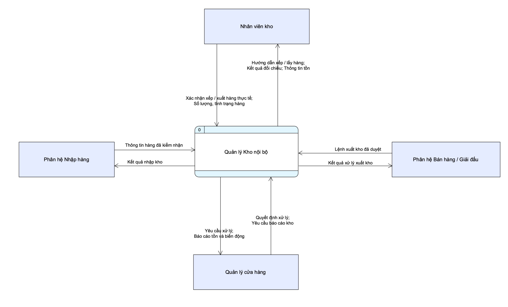

#### Mô hình mức đỉnh (Level 1)

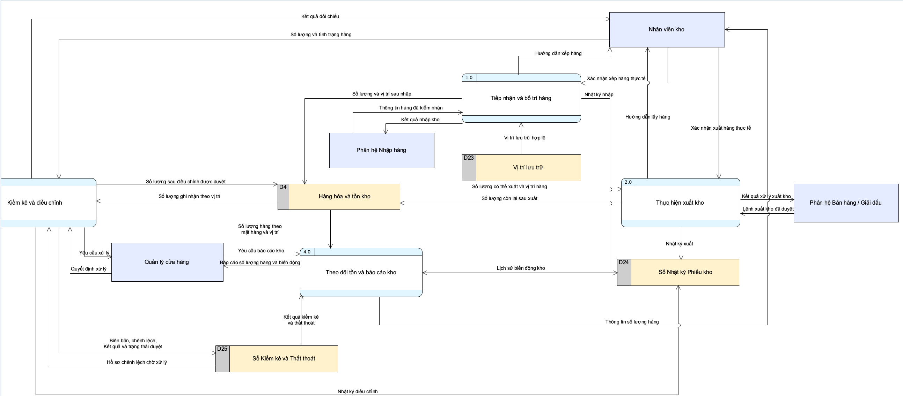

#### Mô hình mức dưới đỉnh (Level 2)

**1.0 — Tiếp nhận và bố trí hàng**

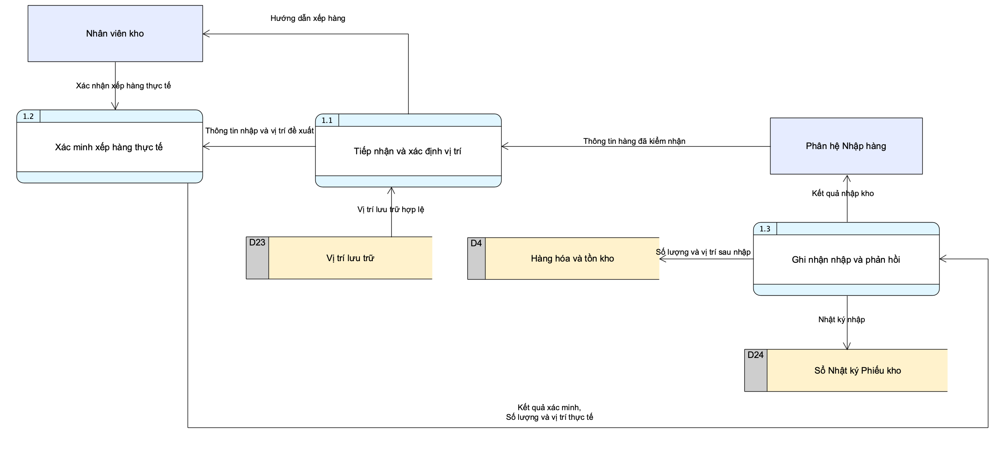

**2.0 — Thực hiện xuất kho**

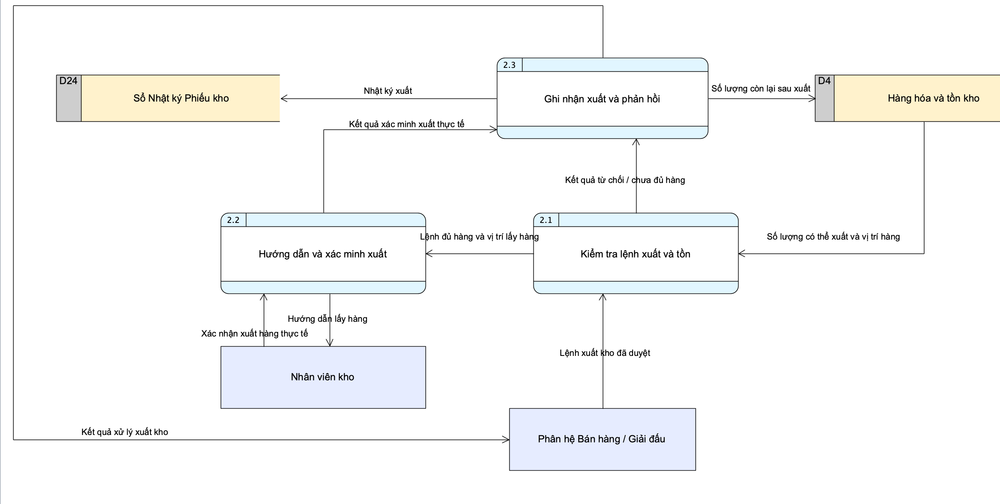

**3.0 — Kiểm kê và điều chỉnh**

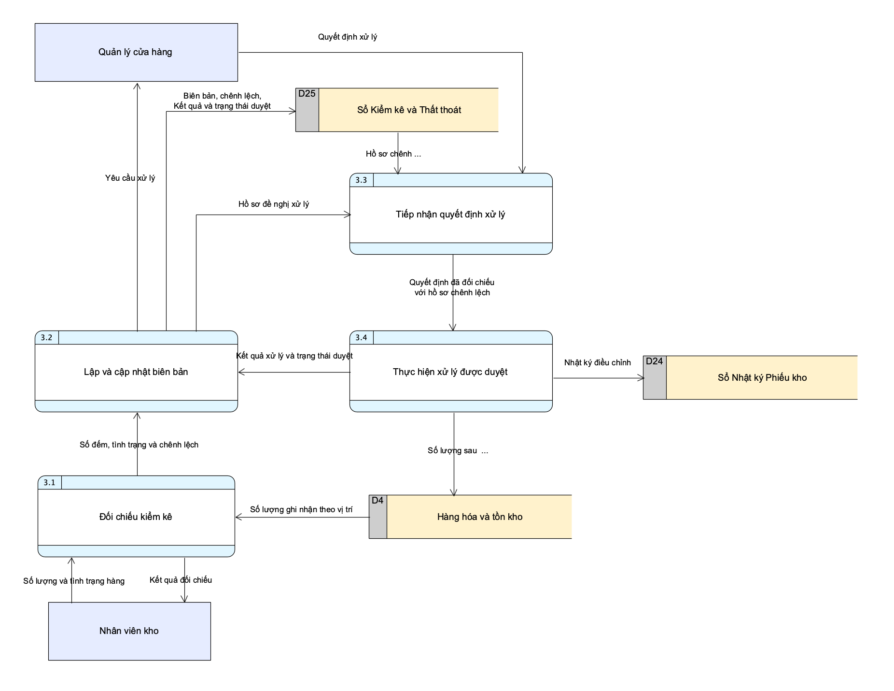

**4.0 — Theo dõi tồn và báo cáo kho**

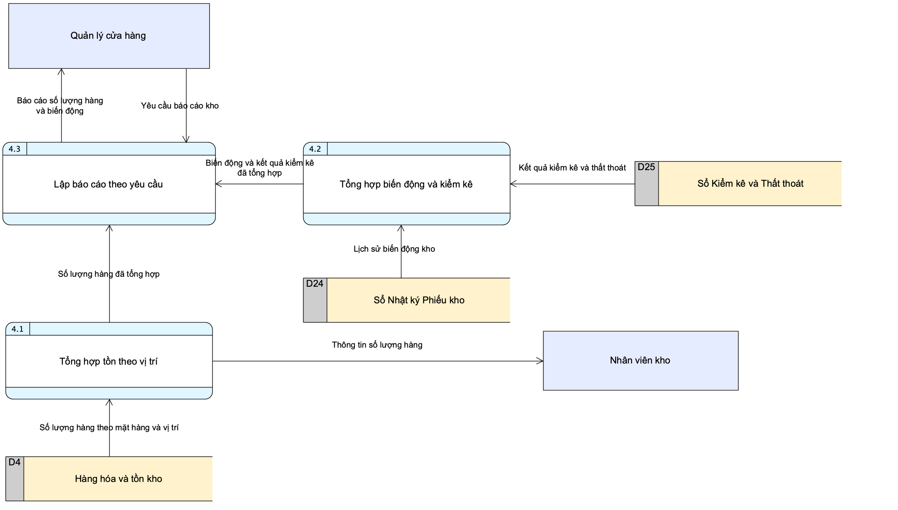

#### Bảng danh sách câu hỏi và trả lời

##### **a. Danh sách câu hỏi và trả lời liên quan đến các ô xử lý (Process)**

1. **Mức 1 gồm những tiến trình nào?**
   1.0 Tiếp nhận và bố trí hàng; 2.0 Thực hiện xuất kho; 3.0 Kiểm kê và điều chỉnh; 4.0 Theo dõi tồn và báo cáo kho.

2. **Tiến trình 1.0 được phân rã như thế nào?**
   1.1 Tiếp nhận và xác định vị trí; 1.2 Xác minh xếp hàng thực tế; 1.3 Ghi nhận nhập và phản hồi.

3. **Tiến trình 2.0 được phân rã như thế nào?**
   2.1 Kiểm tra lệnh xuất và tồn; 2.2 Hướng dẫn và xác minh xuất; 2.3 Ghi nhận xuất và phản hồi.

4. **Khi lệnh xuất bị từ chối hoặc chưa đủ hàng, tiến trình nào phản hồi?**
   2.1 chuyển “Kết quả từ chối / chưa đủ hàng” cho 2.3 để trả “Kết quả xử lý xuất kho” về Phân hệ Bán hàng / Giải đấu.

5. **Tiến trình 3.0 xử lý kiểm kê và điều chỉnh như thế nào?**
   3.1 Đối chiếu kiểm kê; 3.2 Lập và cập nhật biên bản; 3.3 Tiếp nhận quyết định xử lý; 3.4 Thực hiện xử lý được duyệt.

6. **Tiến trình 4.0 được phân rã như thế nào?**
   4.1 Tổng hợp tồn theo vị trí; 4.2 Tổng hợp biến động và kiểm kê; 4.3 Lập báo cáo theo yêu cầu.

##### **b. Danh sách câu hỏi và trả lời liên quan đến các dòng dữ liệu (Data Flow)**

1. **Phân hệ Nhập hàng trao đổi dữ liệu gì với Kho?**
   Gửi “Thông tin hàng đã kiểm nhận” vào 1.1; nhận “Kết quả nhập kho” từ 1.3.

2. **Các luồng nội bộ trong phân rã 1.0 là gì?**
   1.1 → 1.2: “Thông tin nhập và vị trí đề xuất”; 1.2 → 1.3: “Kết quả xác minh, Số lượng và vị trí thực tế”.

3. **Phân hệ Bán hàng / Giải đấu trao đổi dữ liệu gì với Kho?**
   Gửi “Lệnh xuất kho đã duyệt” vào 2.1; nhận “Kết quả xử lý xuất kho” từ 2.3.

4. **Các luồng nội bộ trong phân rã 2.0 là gì?**
   2.1 → 2.2: “Lệnh đủ hàng và vị trí lấy hàng”; 2.2 → 2.3: “Kết quả xác minh xuất thực tế”; 2.1 → 2.3: “Kết quả từ chối / chưa đủ hàng”.

5. **Nhân viên kho gửi và nhận những dữ liệu gì?**
   Gửi “Xác nhận xếp hàng thực tế” vào 1.2, “Xác nhận xuất hàng thực tế” vào 2.2 và “Số lượng và tình trạng hàng” vào 3.1. Nhận “Hướng dẫn xếp hàng” từ 1.1, “Hướng dẫn lấy hàng” từ 2.2, “Kết quả đối chiếu” từ 3.1 và “Thông tin số lượng hàng” từ 4.1.

6. **Quản lý cửa hàng gửi và nhận những dữ liệu gì?**
   Nhận “Yêu cầu xử lý” từ 3.2 và “Báo cáo số lượng hàng và biến động” từ 4.3; gửi “Quyết định xử lý” vào 3.3 và “Yêu cầu báo cáo kho” vào 4.3.

7. **Các luồng nội bộ trong phân rã 3.0 là gì?**
   3.1 → 3.2: “Số đếm, tình trạng và chênh lệch”; 3.2 → 3.3: “Hồ sơ đề nghị xử lý”; 3.3 → 3.4: “Quyết định đã đối chiếu với hồ sơ chênh lệch”; 3.4 → 3.2: “Kết quả xử lý và trạng thái duyệt”.

8. **Tiến trình lập báo cáo nhận dữ liệu tổng hợp nào?**
   4.3 nhận “Số lượng hàng đã tổng hợp” từ 4.1 và “Biến động và kết quả kiểm kê đã tổng hợp” từ 4.2 để lập báo cáo theo yêu cầu của quản lý.

##### **c. Danh sách câu hỏi và trả lời liên quan đến các kho dữ liệu (Data Store)**

1. **D4 (Hàng hóa và tồn kho) nhận và cung cấp dữ liệu gì?**
   Nhận “Số lượng và vị trí sau nhập” từ 1.3, “Số lượng còn lại sau xuất” từ 2.3 và “Số lượng sau điều chỉnh được duyệt” từ 3.4. Cung cấp “Số lượng có thể xuất và vị trí hàng” cho 2.1, “Số lượng ghi nhận theo vị trí” cho 3.1 và “Số lượng hàng theo mặt hàng và vị trí” cho 4.1.

2. **D23 (Vị trí lưu trữ) cung cấp dữ liệu gì?**
   Cung cấp “Vị trí lưu trữ hợp lệ” cho 1.1 để xác định vị trí bố trí hàng.

3. **D24 (Sổ Nhật ký Phiếu kho) nhận và cung cấp dữ liệu gì?**
   Nhận “Nhật ký nhập” từ 1.3, “Nhật ký xuất” từ 2.3 và “Nhật ký điều chỉnh” từ 3.4; cung cấp “Lịch sử biến động kho” cho 4.2.

4. **D25 (Sổ Kiểm kê và Thất thoát) nhận và cung cấp dữ liệu gì?**
   Nhận “Biên bản, chênh lệch, Kết quả và trạng thái duyệt” từ 3.2; cung cấp “Hồ sơ chênh lệch chờ xử lý” cho 3.3 và “Kết quả kiểm kê và thất thoát” cho 4.2.

##### **d. Danh sách câu hỏi và trả lời liên quan đến các thực thể ngoài (External Entity)**

1. **Sơ đồ kho nội bộ có những thực thể ngoài nào?**
   Nhân viên kho, Quản lý cửa hàng, Phân hệ Nhập hàng và Phân hệ Bán hàng / Giải đấu.

2. **Vì sao Phân hệ Nhập hàng và Phân hệ Bán hàng / Giải đấu là thực thể ngoài?**
   Hai phân hệ nằm ngoài phạm vi quản lý kho nội bộ, cung cấp thông tin hàng đã kiểm nhận hoặc lệnh xuất kho đã duyệt và nhận kết quả xử lý.

3. **Nhân viên kho có vai trò gì?**
   Thực hiện xếp, lấy hàng theo hướng dẫn; xác nhận thao tác thực tế và cung cấp số lượng, tình trạng hàng để đối chiếu kiểm kê.

4. **Quản lý cửa hàng có vai trò gì?**
   Quyết định xử lý chênh lệch và yêu cầu báo cáo kho; nhận yêu cầu xử lý cùng báo cáo số lượng hàng và biến động.

---

### Chức năng: Quản lý Nhân Viên và Cộng Tác Viên

#### Bảng danh sách câu hỏi và trả lời

##### **a. Danh sách câu hỏi và trả lời liên quan đến các ô xử lý (Process)**

1. **Mức ngữ cảnh có bao nhiêu tiến trình và được phân rã như thế nào ở mức 1?**
   Mức ngữ cảnh có một tiến trình: 4 — Hệ thống Quản lý Nhân viên và Cộng tác viên. Mức 1 phân rã thành bốn tiến trình: 4.1 Quản lý hồ sơ nhân viên & CTV; 4.2 Phân ca & Chấm công; 4.3 Tính lương & Hoa hồng; 4.4 Đánh giá & Báo cáo nhân sự.
2. **Tiến trình 4.1 có nhiệm vụ gì và được phân rã thành những tiến trình nào?**
   4.1 tiếp nhận thông tin cá nhân của Nhân viên và CTV, kiểm tra rồi lưu hồ sơ vào D19. Mức 2 gồm 4.1.1 Tiếp nhận & Kiểm tra thông tin và 4.1.2 Lưu hồ sơ nhân viên & CTV. Sơ đồ hiện không có bước phê duyệt hồ sơ.
3. **Tiến trình 4.2 được phân rã thành những tiến trình nào?**
   Có bốn tiến trình: 4.2.1 Tiếp nhận đăng kí ca; 4.2.2 Tiếp nhận yêu cầu nghỉ; 4.2.3 Xếp lịch & Xử lý duyệt ca, nghỉ; 4.2.4 Ghi nhận chấm công.
4. **Ai quyết định duyệt ca, duyệt nghỉ và tiến trình nào xử lý quyết định đó?**
   Quản lí cửa hàng quyết định duyệt. 4.2.3 tổng hợp yêu cầu ca, nghỉ và danh sách nhân viên, gửi yêu cầu cần duyệt cho Quản lí, nhận kết quả duyệt, thông báo cho Nhân viên và ghi lịch làm việc vào D20.
5. **Nếu Nhân viên xin nghỉ thì yêu cầu được xử lý như thế nào?**
   4.2.2 tiếp nhận yêu cầu nghỉ và chuyển cho 4.2.3. Sau khi nhận quyết định từ Quản lí, 4.2.3 gửi lịch làm việc, thông báo duyệt nghỉ cho Nhân viên và cập nhật D20.
6. **Tiến trình 4.2.4 thực hiện việc gì?**
   4.2.4 nhận dữ liệu chấm công từ Nhân viên và ghi vào D21. Sơ đồ hiện chỉ thể hiện ghi nhận chấm công, chưa có luồng đọc D20 để đối chiếu với lịch làm việc.
7. **Tiến trình 4.3 được phân rã như thế nào?**
   4.3.1 Tổng hợp giờ công & Doanh số nhận giờ công từ D21 và báo cáo doanh số từ CTV. 4.3.2 Tính lương & Hoa hồng sử dụng dữ liệu tổng hợp, mức lương và tỉ lệ hoa hồng từ D19, cùng mức hoa hồng từ Quản lí. 4.3.3 Lập phiếu lương & Ghi nhận hoa hồng gửi kết quả cho Nhân viên, CTV và lưu bảng lương, hoa hồng vào D22.
8. **Tiến trình 4.4 được phân rã như thế nào?**
   4.4.1 Tổng hợp dữ liệu nhân sự đọc dữ liệu chấm công từ D21 và dữ liệu lương, hoa hồng từ D22. 4.4.2 Đánh giá hiệu suất tạo kết quả đánh giá cho Nhân viên và chuyển kết quả đánh giá hiệu suất cho 4.4.3 Lập báo cáo nhân sự. 4.4.3 gửi báo cáo cho Quản lí cửa hàng.
9. **Sơ đồ hiện có đủ dữ liệu để đánh giá đi muộn hoặc nghỉ không đúng lịch không?**
   Chưa thể hiện đủ: 4.4 chỉ đọc D21 và D22, chưa đọc lịch làm việc từ D20. Nếu bổ sung đối chiếu công thực tế với lịch dự kiến, cần cập nhật luồng dữ liệu ở cả mức 1 và mức 2.

##### **b. Danh sách câu hỏi và trả lời liên quan đến các dòng dữ liệu (Data Flow)**

1. **Nhân viên gửi những dữ liệu gì vào hệ thống?**
   Thông tin cá nhân vào 4.1; đăng kí ca, yêu cầu nghỉ và dữ liệu chấm công vào 4.2. Ở mức 2, các luồng lần lượt vào 4.1.1, 4.2.1, 4.2.2 và 4.2.4.
2. **Hệ thống trả những dữ liệu gì cho Nhân viên?**
   Lịch làm việc, thông báo duyệt nghỉ từ 4.2; phiếu lương từ 4.3; kết quả đánh giá từ 4.4. Ở mức 2, các luồng lần lượt do 4.2.3, 4.3.3 và 4.4.2 cung cấp.
3. **CTV gửi và nhận những dữ liệu gì?**
   CTV gửi thông tin cá nhân vào 4.1.1 và báo cáo doanh số vào 4.3.1; nhận mức hoa hồng từ 4.3.3. Theo nghiệp vụ đã mô tả, CTV dùng mức hoa hồng để tự trừ khi chuyển tiền lại cho cửa hàng; sơ đồ không biểu diễn việc chuyển tiền thực tế.
4. **Quản lí cửa hàng gửi và nhận những dữ liệu gì?**
   Quản lí gửi duyệt ca, duyệt nghỉ vào 4.2.3 và mức hoa hồng vào 4.3.2; nhận ca, nghỉ cần duyệt từ 4.2.3 và báo cáo nhân sự từ 4.4.3.
5. **Các luồng nội bộ trong phân rã 4.1 và 4.2 là gì?**
   4.1.1 → 4.1.2: “Thông tin đã kiểm tra”; 4.2.1 → 4.2.3: “Yêu cầu ca”; 4.2.2 → 4.2.3: “Yêu cầu nghỉ”.
6. **Các luồng nội bộ trong phân rã 4.3 và 4.4 là gì?**
   4.3.1 → 4.3.2: “Giờ công và doanh số tổng hợp”; 4.3.2 → 4.3.3: “Kết quả tính lương, hoa hồng”; 4.4.1 → 4.4.2: “Dữ liệu nhân sự tổng hợp”; 4.4.2 → 4.4.3: “Kết quả đánh giá hiệu suất”.
7. **Lịch làm việc và dữ liệu chấm công được ghi theo những luồng nào?**
   Ở mức 1, 4.2 ghi “Lịch làm việc” vào D20 và “Dữ liệu chấm công” vào D21. Ở mức 2, hai luồng tương ứng do 4.2.3 và 4.2.4 thực hiện.
8. **Các luồng giữa mức ngữ cảnh, mức 1 và mức 2 được cân bằng như thế nào?**
   Các luồng vào, ra với từng thực thể ở mức ngữ cảnh được phân bổ cho các tiến trình tương ứng ở mức 1. Khi phân rã mức 2, giữ nguyên dữ liệu trao đổi qua ranh giới tiến trình cha; chỉ thêm luồng nội bộ giữa các tiến trình con. Ví dụ, “Đăng kí ca, Yêu cầu nghỉ” vào 4.2 được tách thành hai luồng vào 4.2.1 và 4.2.2.
9. **Luồng “Mức hoa hồng” từ Quản lí và luồng cùng tên gửi cho CTV có vai trò gì?**
   Luồng Quản lí → 4.3.2 cung cấp mức hoa hồng dùng khi tính; luồng 4.3.3 → CTV thông báo mức hoa hồng sau xử lý. Các sơ đồ hiện giữ tên “Mức hoa hồng”; cần phân biệt vai trò hai luồng khi đặc tả chi tiết công thức tính.

##### **c. Danh sách câu hỏi và trả lời liên quan đến các kho dữ liệu (Data Store)**

1. **Chức năng sử dụng những kho dữ liệu nào?**
   D19 Hồ sơ nhân viên & CTV; D20 Lịch làm việc; D21 Chấm công; D22 Bảng lương & hoa hồng. Các mã này tiếp nối danh mục kho dữ liệu chung D1–D18 của hệ thống.
2. **D19 nhận và cung cấp những dữ liệu gì?**
   4.1.2 ghi “Thông tin nhân viên & CTV” vào D19. D19 cung cấp “Danh sách nhân viên” cho 4.2.3 và “Mức lương, Tỉ lệ hoa hồng” cho 4.3.2.
3. **D20 lưu dữ liệu gì và được cập nhật bởi tiến trình nào?**
   D20 lưu lịch làm việc do 4.2.3 ghi sau xử lý xếp lịch, duyệt ca và nghỉ. Các sơ đồ hiện chưa thể hiện luồng đọc từ D20.
4. **D21 được ghi và đọc bởi những tiến trình nào?**
   4.2.4 ghi “Dữ liệu chấm công” vào D21. 4.3.1 đọc “Giờ công” để tính lương; 4.4.1 đọc “Dữ liệu chấm công” để tổng hợp dữ liệu nhân sự.
5. **D22 được ghi và đọc bởi những tiến trình nào?**
   4.3.3 ghi “Bảng lương, Hoa hồng” vào D22; 4.4.1 đọc “Dữ liệu lương, Hoa hồng” để tổng hợp và đánh giá nhân sự.
6. **Vì sao lịch làm việc và chấm công được tách thành hai kho?**
   D20 lưu lịch dự kiến, còn D21 lưu công thực tế. Hai loại dữ liệu có mục đích khác nhau; việc tách kho giúp phân biệt rõ luồng xếp lịch với luồng ghi nhận chấm công.
7. **Kho dữ liệu trong DFD có phải là một cơ sở dữ liệu riêng không?**
   Không bắt buộc. Kho dữ liệu là nơi lưu trữ logic trong DFD. Khi triển khai, D19 có thể ánh xạ vào các bảng NHAN_VIEN và CONG_TAC_VIEN; D20 vào LICH_LAM_VIEC; D21 vào CHAM_CONG; D22 vào BANG_LUONG và HOA_HONG. Các nhóm bảng có thể cùng nằm trong một cơ sở dữ liệu; sơ đồ DFD không quyết định số cơ sở dữ liệu vật lý.

##### **d. Danh sách câu hỏi và trả lời liên quan đến các thực thể ngoài (External Entity)**

1. **Các thực thể ngoài tương tác với chức năng này là ai?**
   Nhân viên, Cộng tác viên và Quản lí cửa hàng.
2. **Vai trò của Nhân viên trong chức năng này là gì?**
   Nhân viên cung cấp thông tin cá nhân, đăng kí ca, yêu cầu nghỉ và dữ liệu chấm công; nhận lịch làm việc, thông báo duyệt nghỉ, phiếu lương và kết quả đánh giá.
3. **Vai trò của CTV trong chức năng này là gì?**
   CTV cung cấp thông tin cá nhân và báo cáo doanh số; nhận mức hoa hồng. CTV được quản lý qua mã định danh, không có tài khoản đăng nhập hệ thống theo đặc tả nghiệp vụ.
4. **Vai trò của Quản lí cửa hàng trong chức năng này là gì?**
   Quản lí duyệt ca, duyệt nghỉ và cung cấp mức hoa hồng; nhận yêu cầu ca, nghỉ cần duyệt và báo cáo nhân sự.

#### Mô hình mức ngữ cảnh (Context Level)

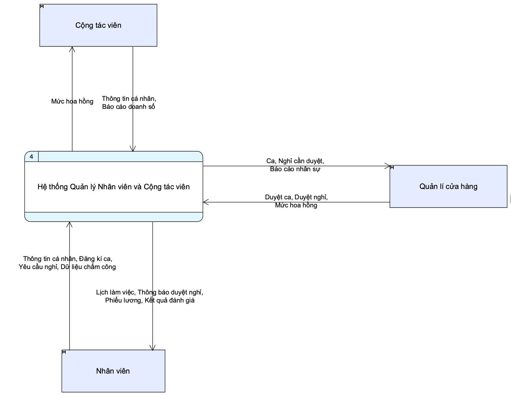

Ảnh mức ngữ cảnh được thay bằng ảnh cập nhật do người dùng cung cấp.

#### Mô hình mức đỉnh (Level 1)

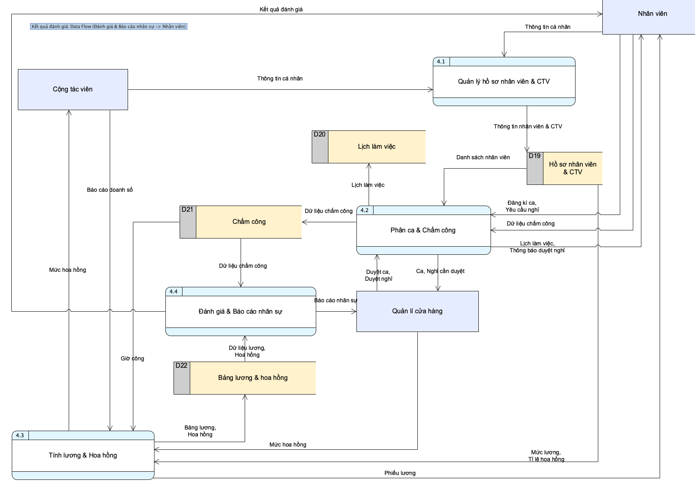

Ảnh mức 1 được cập nhật theo bố cục do người dùng cung cấp, làm cơ sở phân tích phân rã mức 2.

Mỗi thực thể ngoài và mỗi kho dữ liệu chỉ xuất hiện một lần trong từng sơ đồ DFD. D20 chỉ lưu lịch; D21 lưu chấm công. [Ảnh phác thảo gốc](./diagram_sketch/2_Level_1%20%281%29.png) dùng D1–D3 cục bộ và chưa tách hai kho này.

#### Mô hình mức dưới đỉnh (Level 2)

**4.1 — Quản lý hồ sơ nhân viên & CTV**

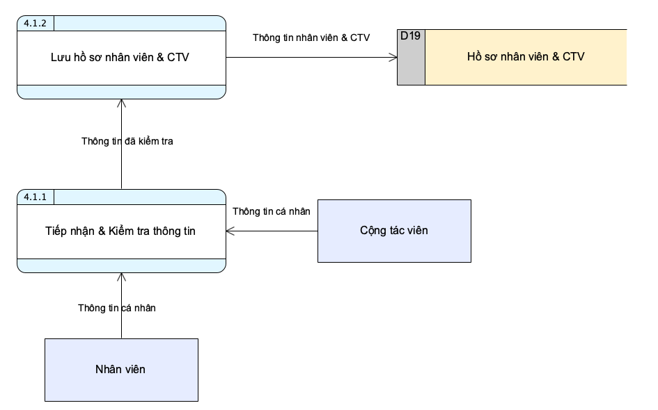

**4.2 — Phân ca & Chấm công**

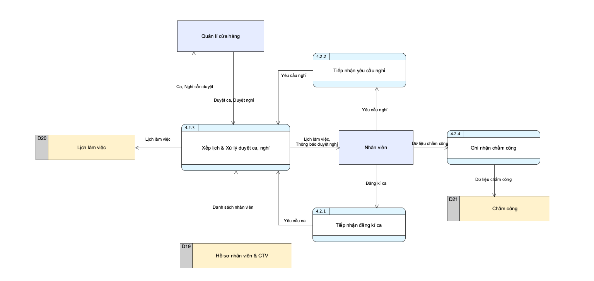

**4.3 — Tính lương & Hoa hồng**

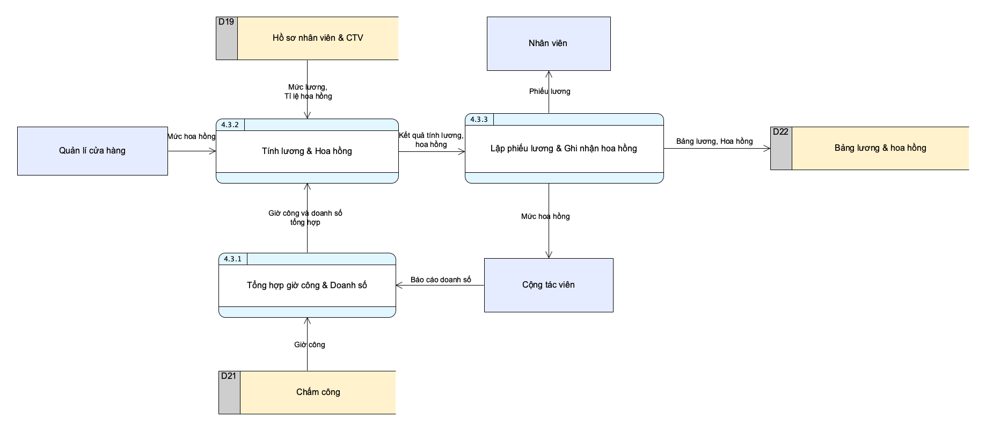

[Ảnh 4.3 được cung cấp trước đó](./images/nhansu/DFD_muc2_4_3_TinhLuongHoaHong_ban1.png)

**4.4 — Đánh giá & Báo cáo nhân sự**

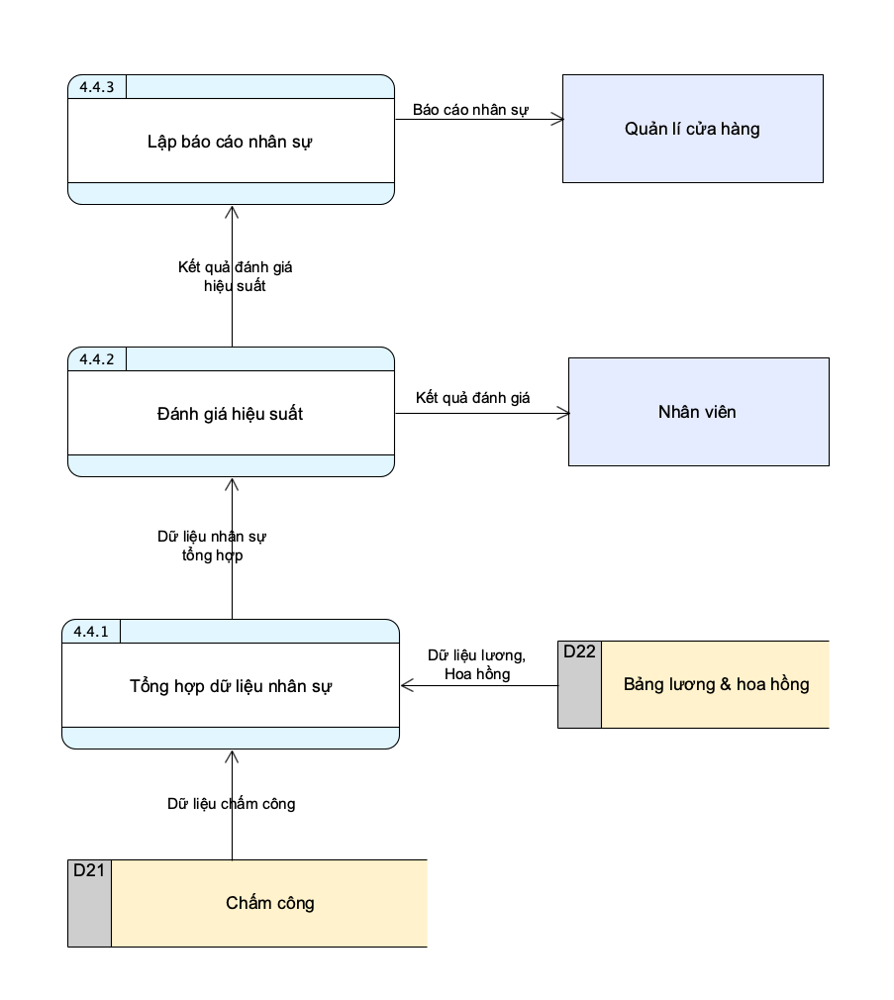

### Chức năng: Quản lý nội dung Fanpage

#### Bảng danh sách câu hỏi và trả lời

##### **a. Danh sách câu hỏi và trả lời liên quan đến các ô xử lý (Process)**

1. **Nhiệm vụ của tiến trình theo dõi và đo lường hiệu suất trong mô hình là gì?**
   Hệ thống tự động thu thập các chỉ số tương tác thực tế (lượt tiếp cận, thích, bình luận, chia sẻ) từ nền tảng Fanpage, ghi nhận vào kho dữ liệu hiệu suất để tổng hợp báo cáo gửi về cho nhân viên marketing và quản lý cửa hàng.
2. **Mức 1 được phân rã thành những tiến trình nào?**
   Có 4 tiến trình: 1.1 Lập kế hoạch nội dung; 1.2 Soạn thảo và kiểm duyệt nội dung; 1.3 Đăng tải và phân phối nội dung; 1.4 Theo dõi tương tác và đo lường hiệu suất.
3. **Tiến trình 1.1 được phân rã thành những tiến trình nào?**
   1.1.1 Xác định mục tiêu, chủ đề và đối tượng; 1.1.2 Xây dựng lịch và phân bổ nội dung; 1.1.3 Hoàn thiện và lưu kế hoạch.
4. **Tiến trình 1.2 được phân rã thành những tiến trình nào?**
   1.2.1 Tiếp nhận kế hoạch, ý tưởng và tài nguyên; 1.2.2 Soạn nội dung, thiết kế ấn phẩm; 1.2.3 Kiểm tra nội dung và gửi duyệt; 1.2.4 Tiếp nhận kết quả, cập nhật trạng thái.
5. **Tiến trình 1.3 được phân rã thành những tiến trình nào?**
   1.3.1 Kiểm tra bài đã duyệt và lịch đăng; 1.3.2 Đăng bài lên nền tảng Fanpage; 1.3.3 Ghi nhận kết quả và cập nhật trạng thái.
6. **Tiến trình 1.4 được phân rã thành những tiến trình nào?**
   1.4.1 Thu thập số liệu bài đăng; 1.4.2 Tổng hợp và đánh giá hiệu suất; 1.4.3 Lưu chỉ số và lập báo cáo.
7. **Nếu quản lý yêu cầu chỉnh sửa bài viết thì tiến trình nào tiếp nhận kết quả?**
   1.2.4 tiếp nhận trạng thái và nhận xét của quản lý, cập nhật trạng thái bài viết và trả kết quả duyệt, yêu cầu chỉnh sửa cho Nhân viên Marketing.

##### **b. Danh sách câu hỏi và trả lời liên quan đến các dòng dữ liệu (Data Flow)**

1. **Luồng dữ liệu chính đi từ Nhân viên Marketing vào hệ thống trong quy trình này là gì?**
   Kế hoạch nội dung định kỳ, ý tưởng, văn bản, hình ảnh/banner thiết kế, yêu cầu lên lịch đăng bài và các yêu cầu gỡ bài hoặc cập nhật phát sinh.
2. **Quản lý cửa hàng gửi và nhận những dữ liệu gì?**
   Quản lý nhận bài viết cần duyệt và báo cáo hiệu quả; gửi kết quả phê duyệt, trạng thái bài viết, nhận xét và yêu cầu chỉnh sửa.
3. **Nền tảng Fanpage gửi và nhận những dữ liệu gì?**
   Nền tảng nhận bài viết chính thức; gửi mã bài đăng, trạng thái đăng và số liệu tương tác gồm lượt tiếp cận, thích, bình luận, chia sẻ.
4. **Luồng 1.2.2 → 1.2.3 mang dữ liệu gì?**
   Bản nháp nội dung và ấn phẩm được chuyển sang bước kiểm tra nội dung và gửi duyệt.
5. **Luồng 1.3.1 → 1.3.2 mang dữ liệu gì?**
   Bài đã duyệt sau bước kiểm tra bài viết và lịch đăng, để tiến hành đăng lên nền tảng Fanpage.
6. **Luồng 1.4.2 → 1.4.3 mang dữ liệu gì?**
   Chỉ số tương tác đã tổng hợp và kết quả so sánh mục tiêu, phục vụ lưu chỉ số và lập báo cáo.

##### **c. Danh sách câu hỏi và trả lời liên quan đến các kho dữ liệu (Data Store)**

1. **Kho lưu trữ dữ liệu chính nào được sử dụng trong quá trình quản lý nội dung Fanpage?**
   Các kho dữ liệu chính gồm: Kho kế hoạch nội dung Fanpage (D16), Kho bài viết & tài nguyên truyền thông (D17), và Kho chỉ số tương tác & hiệu suất nội dung (D18).
2. **D16 cung cấp dữ liệu cho tiến trình nào?**
   1.1.3 ghi kế hoạch vào D16; 1.2.1 đọc kế hoạch nội dung từ D16 để tiếp nhận và chuẩn bị soạn thảo.
3. **D17 được đọc và cập nhật ở những bước nào?**
   1.2.4 ghi bài viết và trạng thái vào D17; 1.3.1 đọc bài viết đã duyệt và yêu cầu gỡ bài từ D17; 1.3.3 cập nhật trạng thái đăng vào D17.
4. **D18 được đọc và cập nhật ở những bước nào?**
   1.4.3 ghi dữ liệu thống kê tổng hợp vào D18; 1.4.2 đọc dữ liệu tương tác đã lưu để tổng hợp và đánh giá hiệu suất.
5. **D17 và D18 khác nhau thế nào?**
   D17 lưu bài viết, tài nguyên truyền thông và trạng thái bài viết; D18 lưu số liệu tương tác và hiệu suất để phục vụ đánh giá, báo cáo.

##### **d. Danh sách câu hỏi và trả lời liên quan đến các thực thể ngoài (External Entity)**

1. **Xác định các tác nhân ngoài tương tác trực tiếp với chức năng "Quản lý nội dung Fanpage"?**
   Các tác nhân ngoài bao gồm: Nhân viên Marketing (lên kế hoạch, soạn thảo và gửi yêu cầu đăng bài), Quản lý cửa hàng (kiểm duyệt, phê duyệt hoặc yêu cầu chỉnh sửa nội dung), và Nền tảng Fanpage (môi trường mạng xã hội nhận bài viết hiển thị và trả về dữ liệu tương tác).
2. **Nhân viên Marketing nhận những kết quả gì từ hệ thống?**
   Kết quả duyệt, yêu cầu chỉnh sửa hoặc gỡ bài, cùng báo cáo hiệu quả nội dung.
3. **Những tác nhân nào nhận báo cáo hiệu quả nội dung?**
   Quản lý cửa hàng và Nhân viên Marketing nhận báo cáo do tiến trình 1.4.3 lập.

#### Mô hình mức ngữ cảnh (Context Level)

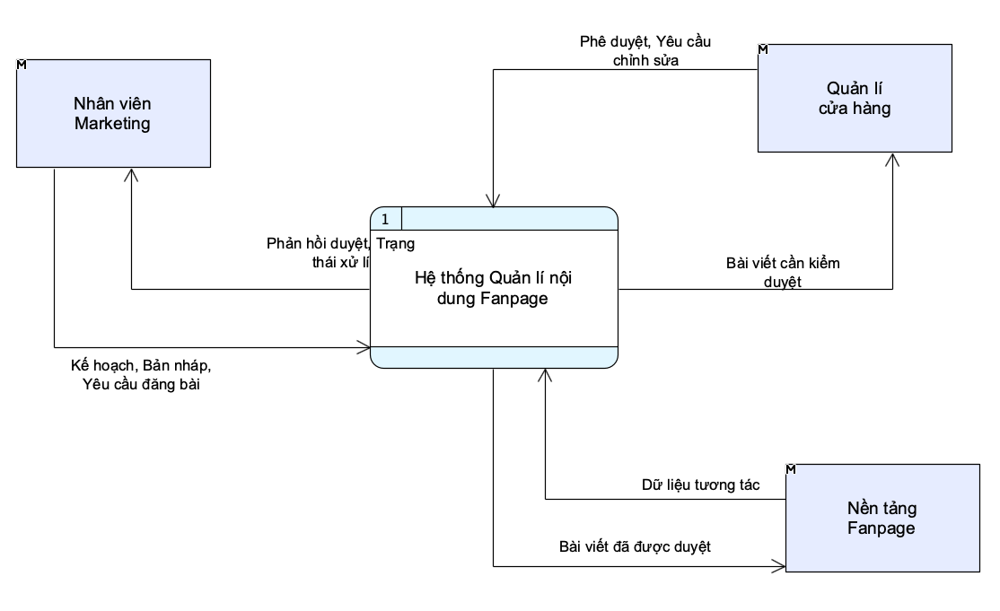

#### Mô hình mức đỉnh (Level 1)

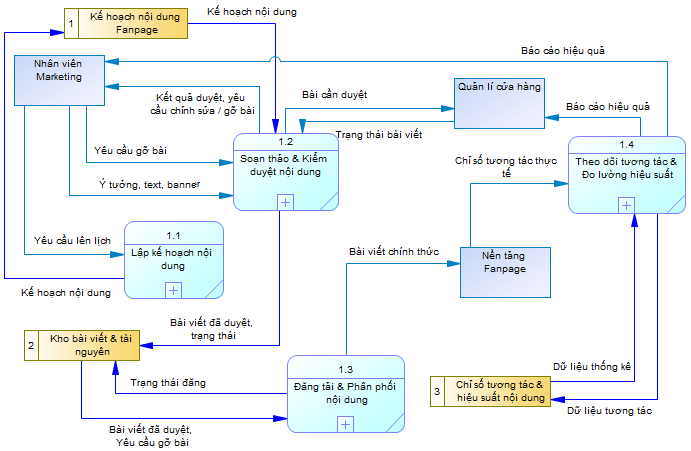

#### Mô hình mức dưới đỉnh (Level 2)

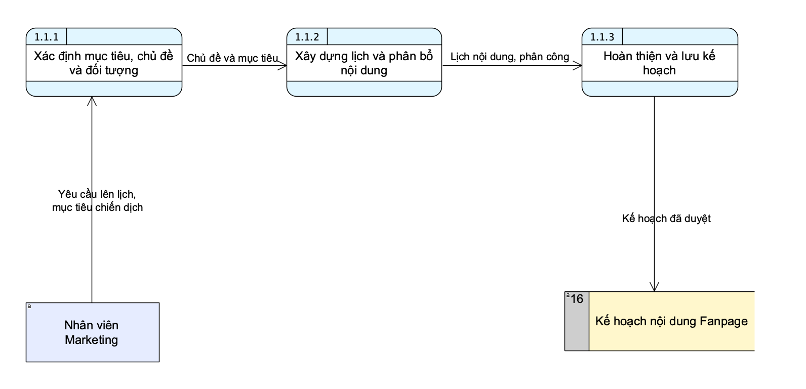

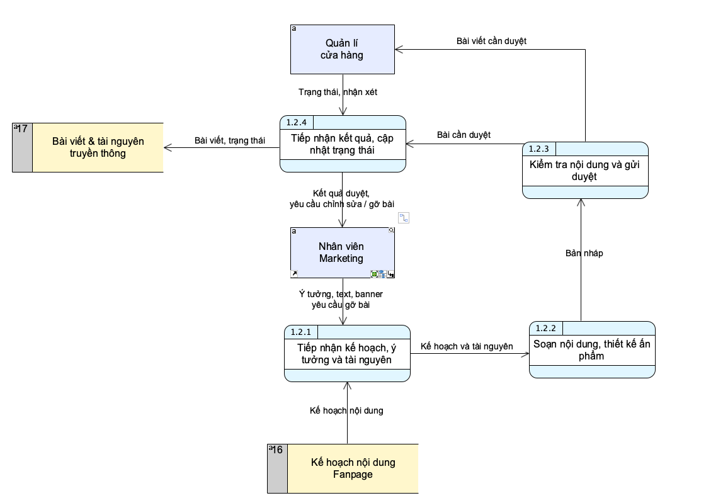

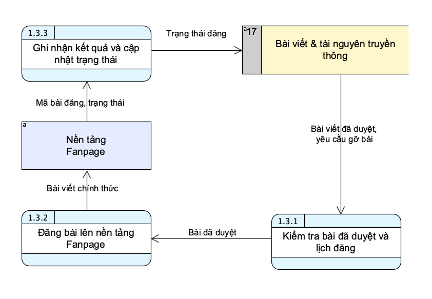

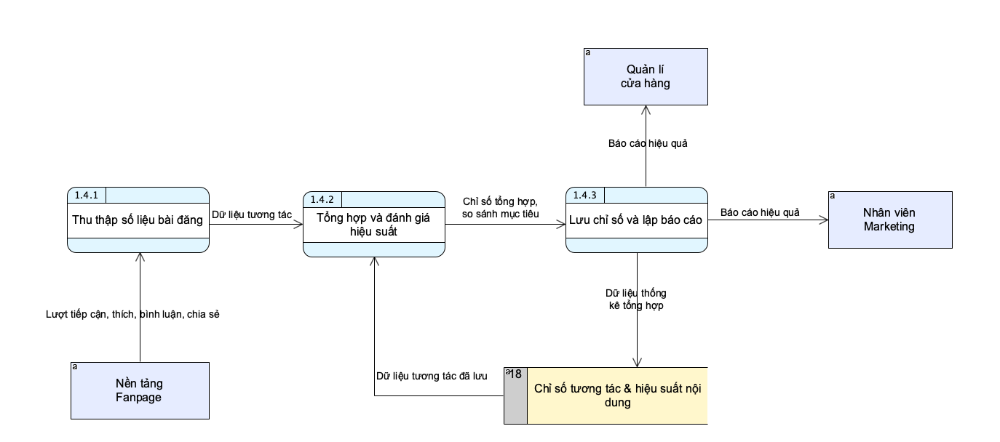
---
