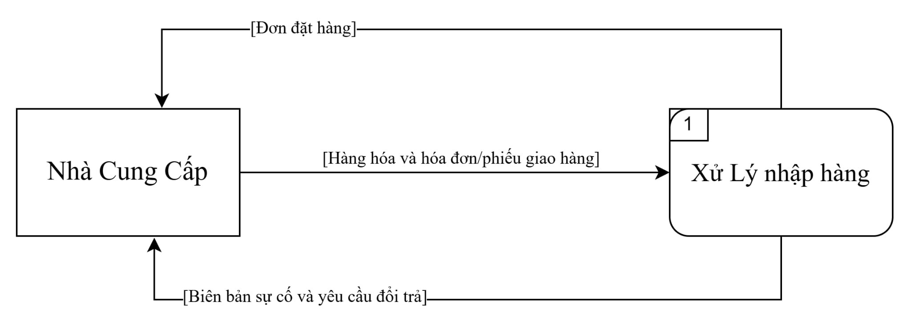
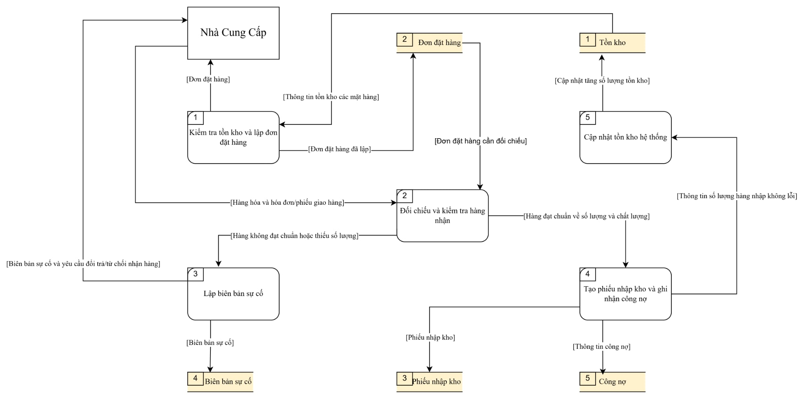
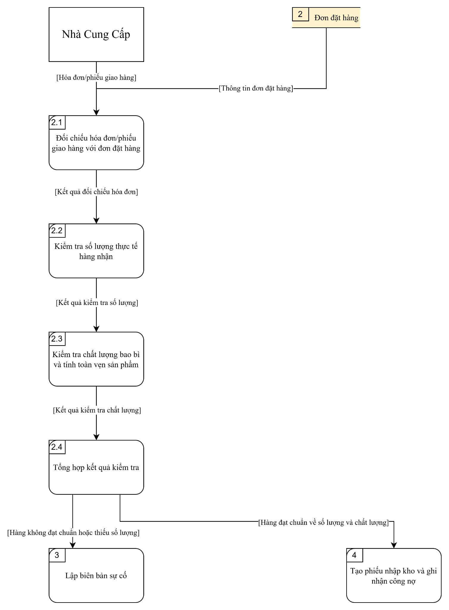

# ĐẶC TẢ HỆ THỐNG

## 1. Liệt kê các chức năng và đặc tả quy trình hoạt động, xử lý của hệ thống

### 1.1. Danh sách các chức năng
1. Chức năng Nhập hàng
2. Chức năng Quản lý Kho
3. Chức năng Bán Hàng
4. Chức năng Quản lý Nhân Viên và Cộng Tác Viên
5. Chức năng Quản lý Giải Đấu và Tài Trợ Sự Kiện

### 1.2. Đặc tả quy trình hoạt động và xử lý

#### Chức năng: Nhập hàng
- **Mục đích:** Quản lý quy trình mua hàng từ nhà cung cấp, kiểm đếm số lượng, chất lượng và cập nhật dữ liệu nhập kho vào hệ thống.
- **Đối tượng thực hiện:** Quản lý cửa hàng, Nhân viên mua/nhập hàng.
- **Quy trình hoạt động & xử lý:**  
  Quy trình nhập hàng bắt đầu khi nhân viên kiểm tra lượng tồn kho và nhận thấy các mặt hàng phụ kiện  chạm mức tối thiểu, từ đó tiến hành lập đơn đặt hàng  gửi đến nhà cung cấp. Khi nhận được hàng bàn giao, nhân viên kho cùng quản lý tiến hành đối chiếu với hóa đơn chứng từ, kiểm tra thực tế số lượng, chất lượng bao bì và tính toàn vẹn của từng sản phẩm. Nếu lô hàng đạt chuẩn, nhân viên tạo phiếu nhập kho trên hệ thống để ghi nhận công nợ và tự động cập nhật tăng số lượng tồn kho theo thời gian thực. Trường hợp phát hiện hàng hóa không đạt chuẩn hoặc thiếu hụt số lượng, nhân viên sẽ lập biên bản sự cố ngay tại chỗ để từ chối nhận hoặc yêu cầu nhà cung cấp thực hiện đổi trả.

#### Chức năng: Quản lý Kho
- **Mục đích:** Theo dõi chính xác lượng hàng tồn kho tại cửa hàng và các điểm phân phối, quản lý vị trí lưu trữ, điều phối xuất chuyển hàng cho cộng tác viên ở các khu vực và kiểm soát thất thoát hàng hóa.
- **Đối tượng thực hiện:** Nhân viên kho, Quản lý cửa hàng.
- **Quy trình hoạt động & xử lý:**  
  Quy trình quản lý kho vận hành liên tục nhằm kiểm soát biến động hàng hóa tại kho chính và các điểm lưu trữ của cộng tác viên ở xa. Mỗi khi phát sinh giao dịch nhập hàng, bán lẻ, xuất chuyển cho cộng tác viên hoặc xuất thưởng giải đấu, hệ thống sẽ tự động cập nhật số lượng tồn kho theo thời gian thực. Khi cộng tác viên tại các khu vực khác có nhu cầu lấy hàng về bán, nhân viên kho lập phiếu xuất kho chuyển hàng gắn theo mã số của cộng tác viên đó, hệ thống sẽ tự động trừ lượng tồn tại kho chính và ghi nhận số lượng chuyển vào kho ký gửi của cộng tác viên. Định kỳ, nhân viên thực hiện quét mã kiểm kê thực tế tại quầy và đối chiếu số lượng hàng ký gửi từ xa để phát hiện sai lệch, hàng hư hỏng nhằm xử lý thất thoát. Trường hợp cộng tác viên không bán hết hoặc đổi trả, kho sẽ lập phiếu nhập hoàn để thu hồi hàng về kho chính.

#### Chức năng: Bán Hàng
- **Mục đích:** Quản lý và xử lý toàn diện quy trình bán hàng đa kênh bao gồm bán trực tiếp tại quầy và bán hàng trực tuyến (qua trang mạng, kênh bán hàng); tính tiền, áp dụng ưu đãi, xác nhận thanh toán, đóng gói giao vận và in hóa đơn cho khách hàng.
- **Đối tượng thực hiện:** Thu ngân, Nhân viên xử lý đơn trực tuyến, Khách hàng (tại quầy và mua từ xa), Đơn vị vận chuyển.
- **Quy trình hoạt động & xử lý:**  
  Quy trình bán hàng tiếp nhận và xử lý đơn hàng linh hoạt qua cả hai kênh trực tiếp tại quầy và bán hàng trực tuyến. Đối với khách mua tại quầy, nhân viên thu ngân quét mã vạch sản phẩm; đối với đơn hàng mua từ xa, nhân viên tiếp nhận thông tin từ hệ thống để xác nhận đơn và tạo phiếu đặt hàng. Hệ thống tự động kiểm tra lượng hàng tồn sẵn sàng bán, áp dụng phiếu giảm giá, tích điểm thành viên và tính toán phí vận chuyển. Khách hàng lựa chọn các phương thức thanh toán linh hoạt như tiền mặt, chuyển khoản qua mã phản hồi nhanh, thẻ ngân hàng hoặc thanh toán khi nhận hàng. Ngay khi thanh toán thành công hoặc đơn hàng từ xa được duyệt, hệ thống tự động trừ kho tức thời, in hóa đơn và phiếu gửi hàng để giao cho đơn vị vận chuyển hoặc đưa trực tiếp cho khách, đồng thời ghi nhận doanh thu vào hệ thống. Quy trình cũng hỗ trợ tiếp nhận đổi trả cho cả hai kênh nếu sản phẩm còn nguyên bao bì và có hóa đơn hợp lệ.

#### Chức năng: Quản Lý Nhân Viên và Cộng Tác Viên
- **Mục đích:** Quản lý hồ sơ, phân quyền tài khoản, theo dõi ca làm việc và đánh giá hiệu suất bán hàng của nhân viên chính thức; đồng thời quản lý thông tin, cấp mã số định danh, theo dõi danh mục hàng hóa cấp phát, kiểm soát công nợ sản phẩm và thanh toán hoa hồng cho cộng tác viên tại các khu vực xa (cộng tác viên không có tài khoản đăng nhập hệ thống).
- **Đối tượng thực hiện:** Quản lý cửa hàng, Nhân viên bán hàng (Cộng tác viên được quản lý qua mã số định danh, không có tài khoản đăng nhập).
- **Quy trình hoạt động & xử lý:**  
  Quy trình quản lý nhân sự tập trung vào việc điều phối nhân lực và quản lý hoạt động phân phối hàng hóa của cộng tác viên. Quản lý thực hiện cấp tài khoản cho nhân viên làm việc tại quầy để xếp ca, chấm công và theo dõi doanh thu ca trực. Riêng đội ngũ cộng tác viên tại các khu vực xa không được cấp tài khoản truy cập hệ thống mà chỉ được cấp một mã số cộng tác viên định danh. Khi cộng tác viên nhập hàng từ kho về bán, hệ thống sẽ ghi nhận danh mục và số lượng sản phẩm cấp phát theo mã số tương ứng để theo dõi công nợ hàng hóa. Đến kỳ đối soát, quản lý cập nhật số lượng hàng cộng tác viên đã bán thực tế và số tiền nộp về để hệ thống tự động tính toán theo tỷ lệ hoa hồng chiết khấu, đồng thời kiểm soát lượng hàng còn tồn đọng hoặc hư hỏng tại từng khu vực.

#### Chức năng: Quản Lý Giải Đấu và Tài Trợ Sự Kiện
- **Mục đích:** 
  - Tổ chức, vận hành và điều phối các sự kiện, giải đấu giao lưu, thi đấu tại cửa hàng từ khâu đăng ký, bốc thăm chia cặp đến tổng kết trao thưởng.
  - Quản lý và khai thác các nguồn lực tài trợ (hiện vật độc quyền, kinh phí tổ chức) từ các đối tác phân phối và nhà sản xuất phụ kiện nhằm giảm chi phí vận hành cho cửa hàng.
  - Tối ưu hóa lợi nhuận, thúc đẩy doanh số bán lẻ phụ kiện thi đấu (bọc bài, hộp đựng bài, thảm đấu) và gia tăng giá trị gắn bó dài lâu của khách hàng.
- **Đối tượng thực hiện:** Quản lý giải đấu, Nhà tài trợ, Trọng tài sự kiện, Người tham gia.
- **Quy trình hoạt động & xử lý:**  
  Quy trình quản lý giải đấu và tài trợ bắt đầu khi ban tổ chức khởi tạo thông tin sự kiện trên hệ thống, xác định thể thức thi đấu, lệ phí tham gia và cơ cấu giải thưởng. Đồng thời, hệ thống tiếp nhận thông tin từ các nhà tài trợ (nếu có), ghi nhận gói tài trợ bằng hiện vật độc quyền (thảm đấu vô địch, bọc bài quảng bá, phụ kiện chính hãng) và cập nhật hiển thị quyền lợi biểu trưng, áp phích quảng bá trên trang sự kiện. Người chơi đăng ký thi đấu, nộp lệ phí trực tiếp hoặc thanh toán từ xa để hệ thống ghi nhận doanh thu và thực hiện điểm danh trước giờ khai mạc. Tiếp đó, hệ thống tự động chia cặp thi đấu theo từng vòng đấu và cho phép trọng tài cập nhật tỷ số trực tiếp. Khi giải đấu kết thúc, hệ thống tự động tổng kết bảng xếp hạng chung cuộc, đồng thời tạo phiếu xuất kho các phần quà tài trợ cùng vật phẩm của cửa hàng để trao thưởng cho đấu thủ chiến thắng.

---
## 2. Phân tích những hạn chế đang tồn tại trong hệ thống và đề xuất giải pháp cải tiến
place holder
---

## 3. Xây dựng mô hình DFD cho từng chức năng

### Chức năng: Nhập Hàng

####  Bảng danh sách câu hỏi và trả lời
Câu hỏi:
1: Trong quy trình Nhập hàng, ai là đối tượng bên ngoài hệ thống mà cửa hàng phải trao đổi dữ liệu để hoàn tất việc mua hàng?
Trả lời:
Đó là Nhà Cung Cấp — bên nhận đơn đặt hàng từ cửa hàng, bàn giao hàng hóa kèm hóa đơn chứng từ, và là nơi nhận lại biên bản sự cố khi hàng không đạt chuẩn để yêu cầu đổi trả. Quản lý cửa hàng và Nhân viên mua/nhập hàng là người xử lý bên trong hệ thống nên không được xem là đối tượng bên ngoài.
2: Những dữ liệu nào cần được lưu trữ lại để phục vụ cho việc kiểm soát và truy vết trong quy trình nhập hàng?
Trả lời: 
Cần lưu trữ: số lượng tồn kho hiện tại (để phát hiện khi chạm mức tối thiểu và cập nhật lại sau khi nhập hàng), đơn đặt hàng đã lập gửi nhà cung cấp, phiếu nhập kho cùng công nợ phát sinh khi lô hàng đạt chuẩn, và biên bản sự cố khi phát hiện hàng không đạt chuẩn hoặc thiếu hụt số lượng.
3: Khi nhà cung cấp bàn giao hàng, thông tin gì được truyền vào hệ thống để phục vụ bước kiểm tra tiếp theo?
Trả lời: 
Hàng hóa thực tế kèm hóa đơn chứng từ (phiếu giao hàng) từ nhà cung cấp được truyền vào, làm căn cứ để nhân viên kho cùng quản lý đối chiếu với đơn đặt hàng và kiểm tra số lượng, chất lượng bao bì, tính toàn vẹn của từng sản phẩm.
4: Bước xử lý đối chiếu, kiểm tra hàng nhận đóng vai trò gì trong toàn bộ quy trình nhập hàng?
Trả lời: 
Đây là bước quyết định hướng xử lý tiếp theo của cả quy trình: nếu hàng hóa đạt chuẩn về số lượng, chất lượng và tính toàn vẹn thì chuyển sang lập phiếu nhập kho, ghi nhận công nợ và cập nhật tồn kho; ngược lại, nếu phát hiện không đạt chuẩn hoặc thiếu hụt số lượng thì chuyển sang lập biên bản sự cố để từ chối nhận hàng hoặc yêu cầu nhà cung cấp đổi trả.

#### Mô hình mức ngữ cảnh (Context Level)

#### Mô hình mức đỉnh (Level 1)

#### Mô hình mức dưới đỉnh (Level 2)

### Chức năng: Bán Hàng

####  Bảng danh sách câu hỏi và trả lời
Câu hỏi:
Trả lời:

#### Mô hình mức ngữ cảnh (Context Level)

#### Mô hình mức đỉnh (Level 1)

#### Mô hình mức dưới đỉnh (Level 2)

### Chức năng: Tổ Chức Giải Đấu & Tài Trợ Sự Kiện

####  Bảng danh sách câu hỏi và trả lời
Câu hỏi:
Trả lời:

#### Mô hình mức ngữ cảnh (Context Level)

#### Mô hình mức đỉnh (Level 1)

#### Mô hình mức dưới đỉnh (Level 2)

---
