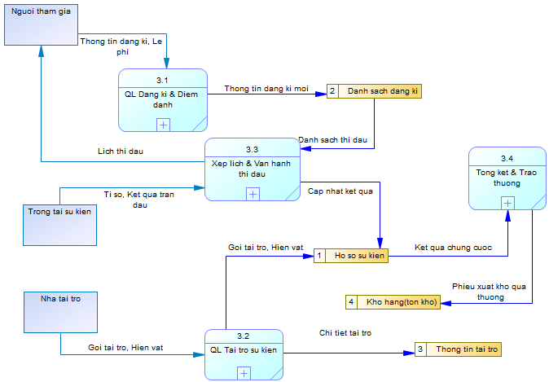
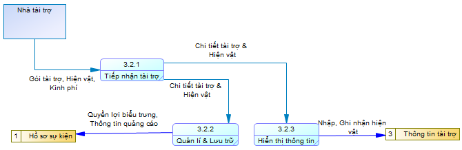
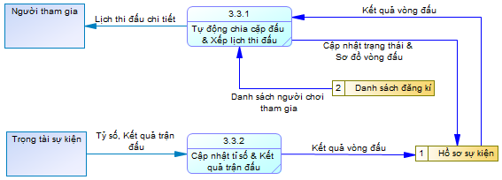
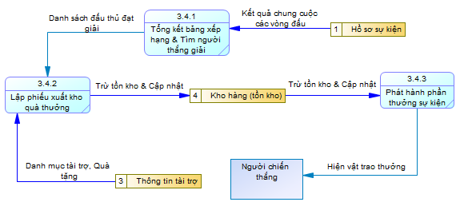

# ĐẶC TẢ HỆ THỐNG

## 1. Liệt kê các chức năng và đặc tả quy trình hoạt động, xử lý của hệ thống

### 1.1. Danh sách các chức năng
1. Chức năng Nhập hàng
2. Chức năng Quản lý Kho
3. Chức năng Bán Hàng
4. Chức năng Quản lý Nhân Viên và Cộng Tác Viên
5. Chức năng Quản lý Giải Đấu và Tài Trợ Sự Kiện

### 1.2. Đặc tả quy trình hoạt động và xử lý

#### Chức năng: Nhập hàng
- **Mục đích:** Quản lý quy trình mua hàng từ nhà cung cấp, kiểm đếm số lượng, chất lượng và cập nhật dữ liệu nhập kho vào hệ thống.
- **Đối tượng thực hiện:** Quản lý cửa hàng, Nhân viên mua/nhập hàng.
- **Quy trình hoạt động & xử lý:**  
  Quy trình nhập hàng bắt đầu khi nhân viên kiểm tra lượng tồn kho và nhận thấy các mặt hàng phụ kiện  chạm mức tối thiểu, từ đó tiến hành lập đơn đặt hàng  gửi đến nhà cung cấp. Khi nhận được hàng bàn giao, nhân viên kho cùng quản lý tiến hành đối chiếu với hóa đơn chứng từ, kiểm tra thực tế số lượng, chất lượng bao bì và tính toàn vẹn của từng sản phẩm. Nếu lô hàng đạt chuẩn, nhân viên tạo phiếu nhập kho trên hệ thống để ghi nhận công nợ và tự động cập nhật tăng số lượng tồn kho theo thời gian thực. Trường hợp phát hiện hàng hóa không đạt chuẩn hoặc thiếu hụt số lượng, nhân viên sẽ lập biên bản sự cố ngay tại chỗ để từ chối nhận hoặc yêu cầu nhà cung cấp thực hiện đổi trả.

#### Chức năng: Quản lý Kho
- **Mục đích:** Theo dõi chính xác lượng hàng tồn kho tại cửa hàng và các điểm phân phối, quản lý vị trí lưu trữ, điều phối xuất chuyển hàng cho cộng tác viên ở các khu vực và kiểm soát thất thoát hàng hóa.
- **Đối tượng thực hiện:** Nhân viên kho, Quản lý cửa hàng.
- **Quy trình hoạt động & xử lý:**  
  Quy trình quản lý kho vận hành liên tục nhằm kiểm soát biến động hàng hóa tại kho chính và các điểm lưu trữ của cộng tác viên ở xa. Mỗi khi phát sinh giao dịch nhập hàng, bán lẻ, xuất chuyển cho cộng tác viên hoặc xuất thưởng giải đấu, hệ thống sẽ tự động cập nhật số lượng tồn kho theo thời gian thực. Khi cộng tác viên tại các khu vực khác có nhu cầu lấy hàng về bán, nhân viên kho lập phiếu xuất kho chuyển hàng gắn theo mã số của cộng tác viên đó, hệ thống sẽ tự động trừ lượng tồn tại kho chính và ghi nhận số lượng chuyển vào kho ký gửi của cộng tác viên. Định kỳ, nhân viên thực hiện quét mã kiểm kê thực tế tại quầy và đối chiếu số lượng hàng ký gửi từ xa để phát hiện sai lệch, hàng hư hỏng nhằm xử lý thất thoát. Trường hợp cộng tác viên không bán hết hoặc đổi trả, kho sẽ lập phiếu nhập hoàn để thu hồi hàng về kho chính.

#### Chức năng: Bán Hàng
- **Mục đích:** Quản lý và xử lý toàn diện quy trình bán hàng đa kênh bao gồm bán trực tiếp tại quầy và bán hàng trực tuyến (qua trang mạng, kênh bán hàng); tính tiền, áp dụng ưu đãi, xác nhận thanh toán, đóng gói giao vận và in hóa đơn cho khách hàng.
- **Đối tượng thực hiện:** Thu ngân, Nhân viên xử lý đơn trực tuyến, Khách hàng (tại quầy và mua từ xa), Đơn vị vận chuyển.
- **Quy trình hoạt động & xử lý:**  
  Quy trình bán hàng tiếp nhận và xử lý đơn hàng linh hoạt qua cả hai kênh trực tiếp tại quầy và bán hàng trực tuyến. Đối với khách mua tại quầy, nhân viên thu ngân quét mã vạch sản phẩm; đối với đơn hàng mua từ xa, nhân viên tiếp nhận thông tin từ hệ thống để xác nhận đơn và tạo phiếu đặt hàng. Hệ thống tự động kiểm tra lượng hàng tồn sẵn sàng bán, áp dụng phiếu giảm giá, tích điểm thành viên và tính toán phí vận chuyển. Khách hàng lựa chọn các phương thức thanh toán linh hoạt như tiền mặt, chuyển khoản qua mã phản hồi nhanh, thẻ ngân hàng hoặc thanh toán khi nhận hàng. Ngay khi thanh toán thành công hoặc đơn hàng từ xa được duyệt, hệ thống tự động trừ kho tức thời, in hóa đơn và phiếu gửi hàng để giao cho đơn vị vận chuyển hoặc đưa trực tiếp cho khách, đồng thời ghi nhận doanh thu vào hệ thống. Quy trình cũng hỗ trợ tiếp nhận đổi trả cho cả hai kênh nếu sản phẩm còn nguyên bao bì và có hóa đơn hợp lệ.

#### Chức năng: Quản Lý Nhân Viên và Cộng Tác Viên
- **Mục đích:** Quản lý hồ sơ, phân quyền tài khoản, theo dõi ca làm việc và đánh giá hiệu suất bán hàng của nhân viên chính thức; đồng thời quản lý thông tin, cấp mã số định danh, theo dõi danh mục hàng hóa cấp phát, kiểm soát công nợ sản phẩm và thanh toán hoa hồng cho cộng tác viên tại các khu vực xa (cộng tác viên không có tài khoản đăng nhập hệ thống).
- **Đối tượng thực hiện:** Quản lý cửa hàng, Nhân viên bán hàng (Cộng tác viên được quản lý qua mã số định danh, không có tài khoản đăng nhập).
- **Quy trình hoạt động & xử lý:**  
  Quy trình quản lý nhân sự tập trung vào việc điều phối nhân lực và quản lý hoạt động phân phối hàng hóa của cộng tác viên. Quản lý thực hiện cấp tài khoản cho nhân viên làm việc tại quầy để xếp ca, chấm công và theo dõi doanh thu ca trực. Riêng đội ngũ cộng tác viên tại các khu vực xa không được cấp tài khoản truy cập hệ thống mà chỉ được cấp một mã số cộng tác viên định danh. Khi cộng tác viên nhập hàng từ kho về bán, hệ thống sẽ ghi nhận danh mục và số lượng sản phẩm cấp phát theo mã số tương ứng để theo dõi công nợ hàng hóa. Đến kỳ đối soát, quản lý cập nhật số lượng hàng cộng tác viên đã bán thực tế và số tiền nộp về để hệ thống tự động tính toán theo tỷ lệ hoa hồng chiết khấu, đồng thời kiểm soát lượng hàng còn tồn đọng hoặc hư hỏng tại từng khu vực.

#### Chức năng: Quản Lý Giải Đấu và Tài Trợ Sự Kiện
- **Mục đích:** 
  - Tổ chức, vận hành và điều phối các sự kiện, giải đấu giao lưu, thi đấu tại cửa hàng từ khâu đăng ký, bốc thăm chia cặp đến tổng kết trao thưởng.
  - Quản lý và khai thác các nguồn lực tài trợ (hiện vật độc quyền, kinh phí tổ chức) từ các đối tác phân phối và nhà sản xuất phụ kiện nhằm giảm chi phí vận hành cho cửa hàng.
  - Tối ưu hóa lợi nhuận, thúc đẩy doanh số bán lẻ phụ kiện thi đấu (bọc bài, hộp đựng bài, thảm đấu) và gia tăng giá trị gắn bó dài lâu của khách hàng.
- **Đối tượng thực hiện:** Quản lý giải đấu, Nhà tài trợ, Trọng tài sự kiện, Người tham gia.
- **Quy trình hoạt động & xử lý:**  
  Quy trình quản lý giải đấu và tài trợ bắt đầu khi ban tổ chức khởi tạo thông tin sự kiện trên hệ thống, xác định thể thức thi đấu, lệ phí tham gia và cơ cấu giải thưởng. Đồng thời, hệ thống tiếp nhận thông tin từ các nhà tài trợ (nếu có), ghi nhận gói tài trợ bằng hiện vật độc quyền (thảm đấu vô địch, bọc bài quảng bá, phụ kiện chính hãng) và cập nhật hiển thị quyền lợi biểu trưng, áp phích quảng bá trên trang sự kiện. Người chơi đăng ký thi đấu, nộp lệ phí trực tiếp hoặc thanh toán từ xa để hệ thống ghi nhận doanh thu và thực hiện điểm danh trước giờ khai mạc. Tiếp đó, hệ thống tự động chia cặp thi đấu theo từng vòng đấu và cho phép trọng tài cập nhật tỷ số trực tiếp. Khi giải đấu kết thúc, hệ thống tự động tổng kết bảng xếp hạng chung cuộc, đồng thời tạo phiếu xuất kho các phần quà tài trợ cùng vật phẩm của cửa hàng để trao thưởng cho đấu thủ chiến thắng.

---
## 2. Mô tả các kho dữ liệu (Data Store)

| Mã | Tên kho dữ liệu | Mô tả |
| --- | --- | --- |
| D1 | Hồ sơ sự kiện | Lưu thông tin và kết quả giải đấu. |
| D2 | Danh sách đăng ký giải đấu | Lưu đăng ký và điểm danh người tham gia. |
| D3 | Thông tin tài trợ | Lưu các khoản tài trợ cho sự kiện. |
| D4 | Hàng hóa và tồn kho | Lưu thông tin hàng hóa và số lượng tồn. |
| D5 | Danh mục sản phẩm và giá bán | Lưu danh mục sản phẩm và giá bán. |
| D6 | Mã giảm giá và khuyến mãi | Lưu các ưu đãi bán hàng. |
| D7 | Đơn hàng và hóa đơn | Lưu đơn bán hàng và hóa đơn. |
| D8 | Giao dịch thanh toán | Lưu các giao dịch thu, chi và hoàn tiền. |
| D9 | Hồ sơ giao hàng | Lưu thông tin và trạng thái giao hàng. |
| D10 | Hồ sơ đổi trả và hoàn tiền | Lưu đổi trả và hoàn tiền cho khách hàng. |
| D11 | Đối soát cộng tác viên | Lưu kết quả đối soát hàng và tiền với cộng tác viên. |
| D12 | Đơn đặt hàng nhập | Lưu đơn mua hàng từ nhà cung cấp. |
| D13 | Phiếu nhập kho | Lưu các lần nhập hàng vào kho. |
| D14 | Công nợ nhà cung cấp | Lưu khoản phải trả và nợ còn lại của nhà cung cấp. |
| D15 | Biên bản sự cố và đổi trả nhà cung cấp | Lưu sự cố nhập hàng và kết quả đổi trả. |

---

## 3. Phân tích những hạn chế đang tồn tại trong hệ thống và đề xuất giải pháp cải tiến
place holder
---

## 4. Xây dựng mô hình DFD cho từng chức năng

### Chức năng: Nhập Hàng

####  Bảng danh sách câu hỏi và trả lời
Câu hỏi:
Trả lời:

#### Mô hình mức ngữ cảnh (Context Level)

#### Mô hình mức đỉnh (Level 1)

#### Mô hình mức dưới đỉnh (Level 2)

### Chức năng: Bán Hàng

####  Bảng danh sách câu hỏi và trả lời
## **a. Danh sách câu hỏi và trả lời liên quan đến các ô xử lý (Process)**

1. **Mức 1 của chức năng Bán hàng được phân rã thành bao nhiêu tiến trình?**
   Gồm 5 tiến trình: 2.1 Tiếp nhận và kiểm tra đơn hàng; 2.2 Xử lý thanh toán và lập hóa đơn; 2.3 Gửi yêu cầu và theo dõi giao hàng; 2.4 Xử lý đổi trả và hoàn tiền; 2.5 Cấp hàng và đối soát cộng tác viên.
2. **Tiến trình 2.1 được phân rã thành những tiến trình mức 2 nào?**
   Gồm 4 tiến trình: 2.1.1 Tiếp nhận thông tin đặt hàng; 2.1.2 Kiểm tra sản phẩm và giá; 2.1.3 Kiểm tra tồn kho; 2.1.4 Kiểm tra khuyến mãi và tính tổng đơn.
3. **Các tiến trình 2.2, 2.3, 2.4 và 2.5 được phân rã thành bao nhiêu tiến trình mức 2?**
   Mỗi tiến trình được phân rã thành 4 tiến trình mức 2.
4. **Các tiến trình con của 2.2 là gì?**
   2.2.1 Tiếp nhận đơn hàng và phương thức thanh toán; 2.2.2 Ghi nhận giao dịch thanh toán; 2.2.3 Xác nhận thanh toán và lập hóa đơn; 2.2.4 Trả kết quả và chuyển đơn giao.
5. **Các tiến trình con của 2.3, 2.4 và 2.5 là gì?**
   2.3 gồm tiếp nhận đơn đã thanh toán, chuẩn bị/gửi yêu cầu giao hàng, cập nhật mã vận đơn/trạng thái và thông báo tình trạng giao hàng. 2.4 gồm tiếp nhận yêu cầu đổi trả, kiểm tra đơn/điều kiện, ghi nhận đổi trả/yêu cầu hoàn tiền và xử lý hoàn tiền/thông báo kết quả. 2.5 gồm tiếp nhận yêu cầu cấp hàng, kiểm tra tồn kho/cấp hàng, đối chiếu báo cáo doanh số và ghi nhận chuyển tiền/kết quả đối soát.

## **b. Danh sách câu hỏi và trả lời liên quan đến các dòng dữ liệu (Data Flow)**

1. **Khách hàng gửi dữ liệu gì vào hệ thống?**
   Khách tại quầy gửi thông tin mua hàng và yêu cầu đổi trả; khách trực tuyến gửi thông tin đặt hàng, người nhận, phương thức thanh toán và yêu cầu đổi trả.
2. **Hệ thống trả dữ liệu gì cho khách hàng?**
   Hệ thống trả thông tin thanh toán/hóa đơn, xác nhận đơn hàng và mã vận đơn (đối với đơn giao), hoặc kết quả đổi trả và thông tin hoàn tiền.
3. **Cộng tác viên gửi và nhận những dòng dữ liệu nào?**
   Cộng tác viên gửi yêu cầu cấp hàng, báo cáo doanh số và thông tin chuyển tiền. Hệ thống gửi xác nhận cấp hàng, thông tin tồn kho, kết quả đối soát và số tiền phải nộp.
4. **Đơn vị vận chuyển trao đổi dữ liệu gì với hệ thống?**
   Hệ thống gửi thông tin đơn cần giao; đơn vị vận chuyển trả mã vận đơn và trạng thái giao hàng. Hệ thống dùng dữ liệu đó để cập nhật hồ sơ và thông báo khách trực tuyến.

## **c. Danh sách câu hỏi và trả lời liên quan đến các kho dữ liệu (Data Store)**

1. **Các kho dữ liệu nào xuất hiện trong những sơ đồ phân rã bán hàng?**
   D4 Hàng hóa và tồn kho; D5 Danh mục sản phẩm và giá bán; D6 Mã giảm giá và khuyến mãi; D7 Đơn hàng và hóa đơn; D8 Giao dịch thanh toán; D9 Hồ sơ giao hàng; D10 Hồ sơ đổi trả và hoàn tiền; D11 Đối soát cộng tác viên.
2. **Các tiến trình tra cứu hoặc cập nhật những kho nào?**
   2.1 tra cứu D4, D5, D6; 2.2 ghi/tra cứu D7 và D8; 2.3 ghi/cập nhật D9; 2.4 tra cứu D7, ghi D8 khi hoàn tiền và cập nhật D10; 2.5 tra cứu/cập nhật D4, đối chiếu D7 và ghi/cập nhật D11.

## **d. Danh sách câu hỏi và trả lời liên quan đến các thực thể ngoài (External Entity)**

1. **Các thực thể ngoài của hệ thống bán hàng là những ai?**
   Khách hàng tại quầy, khách hàng trực tuyến, cộng tác viên và đơn vị vận chuyển.
2. **Vai trò của từng thực thể ngoài là gì?**
   Hai nhóm khách hàng đặt mua và yêu cầu đổi trả; cộng tác viên yêu cầu cấp hàng, báo cáo doanh số và nộp tiền; đơn vị vận chuyển nhận yêu cầu giao hàng và phản hồi trạng thái cùng mã vận đơn.

#### Mô hình mức ngữ cảnh (Context Level)

#### Mô hình mức đỉnh (Level 1)

#### Mô hình mức dưới đỉnh (Level 2)
##### 2.1 Tiếp nhận và kiểm tra đơn hàng

##### 2.2 Xử lý thanh toán và lập hóa đơn

##### 2.3 Gửi yêu cầu và theo dõi giao hàng

##### 2.4 Xử lý đổi trả và hoàn tiền

##### 2.5 Cấp hàng và đối soát cộng tác viên

### Chức năng: Tổ Chức Giải Đấu & Tài Trợ Sự Kiện

####  Bảng danh sách câu hỏi và trả lời
Câu hỏi 1: Xác định các tác nhân ngoài tương tác trực tiếp với chức năng "Tổ Chức Giải Đấu & Tài Trợ Sự Kiện"?
Trả lời:Các tác nhân ngoài bao gồm: Người tham gia (đăng ký, nộp lệ phí, thi đấu), Nhà tài trợ (cung cấp kinh phí, hiện vật tài trợ), và Trọng tài sự kiện (cập nhật tỷ số, kết quả thi đấu). Quản lý giải đấu là người vận hành bên trong hệ thống.

Câu hỏi 2: Kho lưu trữ dữ liệu chính nào được sử dụng trong quá trình xử lý giải đấu và tài trợ?
Trả lời: Các kho dữ liệu chính gồm: Kho thông tin sự kiện/giải đấu, Kho dữ liệu người tham gia & đăng ký, Kho tài trợ, và liên kết với Kho hàng/Tồn kho (khi xuất vật phẩm trao thưởng).

Câu hỏi 3: Luồng dữ liệu chính đi từ người tham gia vào hệ thống trong quy trình này là gì?
Trả lời: Thông tin đăng ký tham gia giải đấu, thông tin xác nhận nộp lệ phí (hoặc thanh toán lệ phí).

Câu hỏi 4: Nhiệm vụ của tiến trình xử lý kết quả và trao thưởng trong mô hình mức đỉnh là gì?
Trả lời: Hệ thống tự động tổng kết bảng xếp hạng chung cuộc dựa trên tỷ số do trọng tài cập nhật, đồng thời tạo phiếu xuất kho các phần quà tài trợ và vật phẩm của cửa hàng để trao thưởng cho đấu thủ chiến thắng.

#### Mô hình mức ngữ cảnh (Context Level)

#### Mô hình mức đỉnh (Level 1)

#### Mô hình mức dưới đỉnh (Level 2)

---
